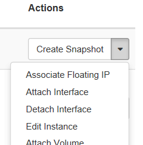

# Configure access and security for instances {#cha:conf-access-secur}

The security and accessibility of your cloud resources is governed by a
few different aspects, which we discuss more detail in the following
sections:

-   Instances must connect to the project's \_vm network in order to get
    external internet access (see section
    [1.1](#sec:_vm-_nfs-networks)).

-   Each cloud project can use one floating IP, a public IP address
    which you'll need to link to the resources you want to access.
    Optionally, if the project has requested access to VSC network it
    will receive also three VSC floating IPs (see section
    [1.2](#sec:floating-ip)).

-   By default, the UGent firewall blocks most IP addresses and ports.
    Only the port (TCP) range **50000-60000** for the public floating IP addresses
    is open by default. Contact <cloud@vscentrum.be> if you need to access other ports from
    the outside world.

-   The OpenStack environment has its own internal firewalls, which
    block most ports of your instances by default. If you want to access
    specific ports of your instances, you must create "Security Groups"
    which allow access to those ports (see section
    [1.3](#sec:security-groups)).

-   You can use one or more SSH keys from your VSC account to access
    your instances (see section
    [1.4](#sec:ssh-key-pairs)).

For other access methods, or SSH authentication for a wider set of
users, you'll need to set up some form of identity management yourself.
This system administration task is beyond the scope of our tutorial.

## The \_vm, \_vsc and \_nfs networks {#sec:_vm-_nfs-networks}

Each project in the VSC cloud has its own network *`<projectname>`*`_vm`
and --- if the project uses shares and/or vsc networks ---
*`<projectname>`*`_nfs` and *`<projectname>`*`_vsc` respectively. Each
is a subnet of 254 addresses, with an ip range 10.10.x.0/24, where _x_
is a number that depends on the project and network. To see the subnets
for your project's networks, open the Network tab, and select Networks.

Instances should use the \_vm network for communication, and the \_nfs
network if they need access to shared file systems (see chapter
[shared file systems](./ch_Shares.tex.md#shared-file-systems)).
On the other hand \_vsc network
is used to connect to or provide VSC services via VSC network and
floating IPs. When an instance is created in
OpenStack and connected to the \_vm, \_nfs or \_vsc networks, it is automatically
assigned a fixed IP address in that network. This IP address is
permanently associated with the instance until the instance is
terminated.

## Floating IP addresses {#sec:floating-ip}

The \_vm, \_nfs and \_vsc networks can only be reached from within the
OpenStack environment. If you need to access an instance from the
outside, you need to use one of your project's floating IP addresses,
which are public IP addresses (193.190.80.0/25 IPs for \_vm network) or
VSC IP addresses (172.24.48.0/20 IPs for \_vsc network). Unlike fixed IP
addresses, floating IP addresses can have their associations modified at
any time, regardless of the state of the instances involved.

Do not release the floating IPs assigned to your project. The floating
IPs are fixed to the project and it is not possible, as regular user, to
re-allocate floating IPs. Please contact to VSC Tier1 Cloud support if
you have released your project's floating IPs by mistake.

This section explains how to make your instance accessible via a public
IP address by two different methods. The preferred method for \_vm
network is to use port forwarding to access multiple instances using the
same public IP address, but you can also use a "floating IP association"
for quick tests or \_vsc network.

### Floating ip port forwarding {#port-forwarding .unnumbered}

OpenStack's networking API, called Neutron, makes it possible to forward
different ports of the same floating ip to arbitrary ports in one of
OpenStack's virtual networks. This is the recommended way to use
floating ip's in the VSC cloud. For the floating IP's available in the
VSC Cloud, the high port range 50000-60000 is open to the outside world,
so it is most convenient to work with ports from this range. Contact if
you need public access to another port for a specific ip address.

You'll need to forward a separate port for every service you wish to
reach. For example, if you want to access an instance using SSH, you'll
need to create a port forwarding rule from a selected port of the
floating IP, to the port in the \_vm network where your instance's SSH
server is listening (typically port 22).

You can quickly set up such forwarding rules using
`neutron_port_forward`, a command line tool available on the UGent login
node, **login.hpc.ugent.be**. In order to use it, you must create an
application credential for the role "User", and save it as an openrc
file (see section [application credentials](./ch_Access.tex.md#sec:appl-cred)
on page ). Transfer the openrc file to your
VSC storage space, so _neutron_port_forward_ can read it. To set up new
port forwarding rules, run the script providing the path to the openrc
file as an argument to the _-o_ option, and a file describing your port
forwarding configuration as argument to the _-m_ option:


```bash
$ neutron_port_forward -o <openrc file> -m <ini-file>
```

The following is an example configuration file:

```
[DEFAULT]
floatingip=193.190.85.40
network=_vm

[classa]
pattern=classa-(+̣)
22=52000:100:22
5900=55900

[classb]
pattern=classb-(+̣)
80=52080
```

Here we define defaults for the floating ip and target network, and two
classes. Instances are assigned to a class if their name matches the
regular expression given in `pattern`. The value of `pattern` must be a
valid Python regular expression, and the first capturing group (if any)
must match an integer.

Port forwarding rules are given in the form
`target=source(:multiplier:offset)`. This will set up a forwarding rule
from the floating IP port:

 > (source + multiplier ∗ i + offset) → target ,

$$(\mathrm{source} + \mathrm{multiplier} * i + \mathrm{offset}) \rightarrow \mathrm{target}\, ,$$

where **_i_** is the integer matched by the first capturing group, and
"target" is a port of the fixed IP for the instance in the chosen
network, in this case the _vm network. "multiplier" and "offset" are
optional and default to 1 and 0 respectively. In our example, this
results in the following set of port forwarding rules for the public IP
address 193.190.85.40:


```
  52122   ->   classa-1:22
  52222   ->   classa-2:22
  ...     
  55901   ->   classa-1:5900
  55902   ->   classa-2:5900
  ...     
  52081   ->   classb-1:80
  52082   ->   classb-2:80
  ...     
```


This is another basic port forwarding configuration example without
patterns, in this case just to connect via SSH using external port 52000
to a running VM called testvm:

```
[DEFAULT]
floatingip=193.190.85.40
network=_vm

[testvm]
22=52000
```

You can also see an overview of existing port forwarding rules for the
ip addresses in your configuration file using
_neutron_port_forward --show_. Each rule has an internal id, which you
can see if you combine the options _--show_ and _--id_ as follows:

```bash
$ neutron_port_forward -o <openrc file> -m <ini-file> --show --id
```

To remove port forwarding rules, use the option
`--remove=<list of id's>` with a comma-separated list of the id's of the
rules you want to remove.

Please note that when you remove and reinstantiate a VM, OpenStack also
removes the port forwarding rules assigned to this VM automatically. If
you intantiate again the same VM you should run `neutron_port_forward`
and restore the port forwarding rules.

`neutron_port_forward` provides a few more options and advanced
features, run the command with the `--help` option for more information.

### Associate a floating ip {#associate-a-floating-ip .unnumbered}

A floating IP address can also be associated to an instance, just like
the fixed IP addresses. Because this approach uses one of the few
available floating ip addresses for every instance you want to connect
to, you should only use it for testing purposes with \_vm network or
with \_vsc network.

If you want to use a floating ip for port forwarding as in the previous
section, it cannot be associated to an instance at the same time.

Use the following procedure to associate that address with a specific
instance.

1.  Open the Network tab.

2.  Click the Floating IPs tab, which shows the floating IP addresses
    allocated to your project.

3.  In the Floating IPs list, click Associate next to the address you
    want.

4.  In the Manage Floating IP Associations dialog box, choose the
    following options:

    **IP Address**

    :   This field is filled automatically.

    **Port to be associated**

    :   Select a port from the list. The list shows all the instances
        with their fixed IP addresses.

5.  Click Associate.

Another way to associate a floating IP is after the user has already
launched an instance which appears in the list of running instances in
the Project->Compute->Instances tab:

1.  Expand the drop-down menu on right next to the instance

2.  Select Associate Floating IP

    

3.  A pop-up window will appear and under IP Address select from the
    drop-down menu an IP address from the available pool.

    

4.  Click Associate

If the IP has been successfully associated in the upper right corner of
the browser screen will appear a green confirmation. If not successful a
red notification will pop up that something went wrong.

To disassociate an IP address from an instance, click the Disassociate
button in the Actions column.

*Do not* use the Release Floating IP option in the Actions column or on
the overview page. This will remove the floating IP from the pool
assigned to your project, something which you, as a regular user, cannot
undo. If you've accidentally released a floating IP, contact to have it
restored.

## Security Groups {#sec:security-groups}

OpenStack security groups are sets of IP filter rules that define
networking access. You can then assign one or more security groups to
your instances.

In the VSC cloud, each project contains a default security group, which
allows you to ping instances and connect using SSH on the default port
22. If you want to access other ports on your instances, create new
security groups with the appropriate rules and assign them to the
instances.

## SSH key pairs {#sec:ssh-key-pairs}

When an instance is launched, OpenStack can automatically install a
public SSH key on it, so as to give anyone with the corresponding
private key admin access. For this "key pair injection[^1]" to work, the
image that the instance is based on must contain the **cloud-init**
package, or have in place another mechanism in place that will interact
with the OpenStack metadata server to install the appropriate key. For
general instructions on SSH keys, we refer to chapter 2 of our
[introduction to HPC](https://hpcugent.github.io/vsc_user_docs).

If you have generated a key pair with an external tool, you can import
it into OpenStack. The key pair can be used for multiple instances that
belong to a project. For more information, see section
[\[import-a-key-pair\]](#import-a-key-pair){reference-type="ref"
reference="import-a-key-pair"}.

The public keys from your VSC account are automatically available in
your VSC Cloud projects, so you can immediately inject one of your
existing into your instances. Of course, you can also import new keys
into OpenStack, which are not coupled to your VSC account. If you want
to give other parties SSH access to VM's, you must manage the keys using
some other method. upload SSH keys for other users to your VSC account.

Every OpenStack user account has its own collection of SSH keys for
every project. To share a public key between multiple users of the same
project, each user needs to import it in the OpenStack project.

### Add a key pair {#add-a-key-pair .unnumbered}

1.  Open the Compute tab.

2.  Click the Key Pairs tab, which shows the key pairs that are
    available for this project.

3.  Click Create Key Pair.

4.  In the Create Key Pair dialog box, enter a name for your key pair,
    and click Create Key Pair.

5.  Respond to the prompt to download the key pair.

6.  Save the **\*.pem** file locally.

7.  To change its permissions so that only you can read and write to the
    file, run the following command:
```bash
      $ chmod 0600 yourPrivateKey.pem
```
**Note:** If you are using the
    [OpenStack Dashboard] from a Windows computer, use PuTTYgen
    to load the **\*.pem** file and convert and save it as **\*.ppk**.
    For more information see the [*WinSCP web page for
    PuTTYgen*](https://winscp.net/eng/docs/ui_puttygen), and chapter 2
    of the [introduction to HPC at
    VSC](https://hpcugent.github.io/vsc_user_docs).

*  To make the key pair known to SSH, run the **ssh-add** command.

```
      $ ssh-add yourPrivateKey.pem
```


### Import a key pair {#import-a-key-pair .unnumbered}

1.  Open the Compute tab.

2.  Click the Key Pairs tab, which shows the key pairs that are
    available for this project.

3.  Click Import Key Pair.

4.  In the Import Key Pair dialog box, enter the name of your key pair,
    copy the public key into the Public Key box, and then click Import
    Key Pair.

The Compute database registers the public key of the key pair.

The [OpenStack Dashboard]{acronym-label="OpenStack Dashboard"
acronym-form="singular+short"} lists the key pair on the Key Pairs tab.

[^1]: The OpenStack documentation and interfaces consistently refer to
    "SSH pairs", but of course only the public key of each pair is
    stored in the OpenStack environment, while the private key should be
    kept secure by the owner.
