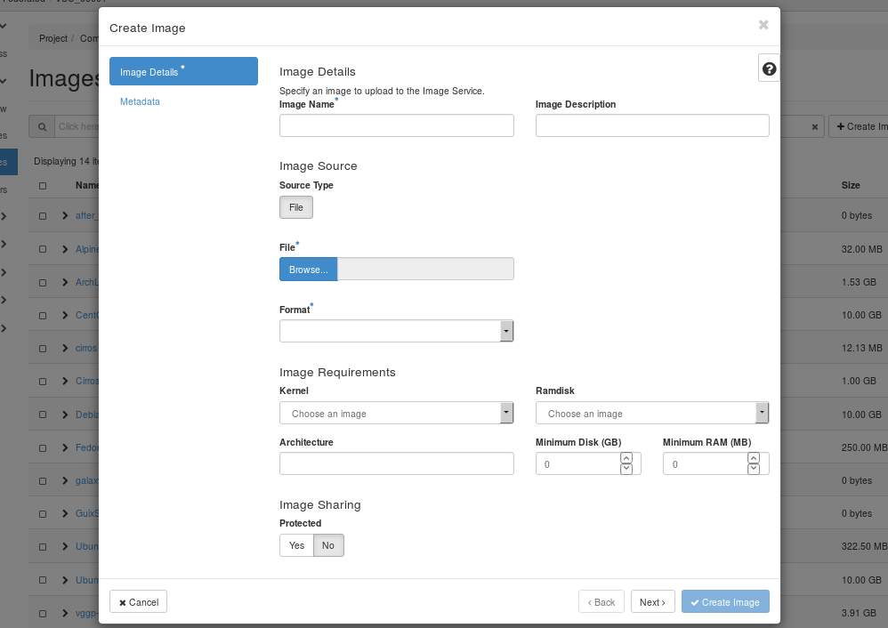
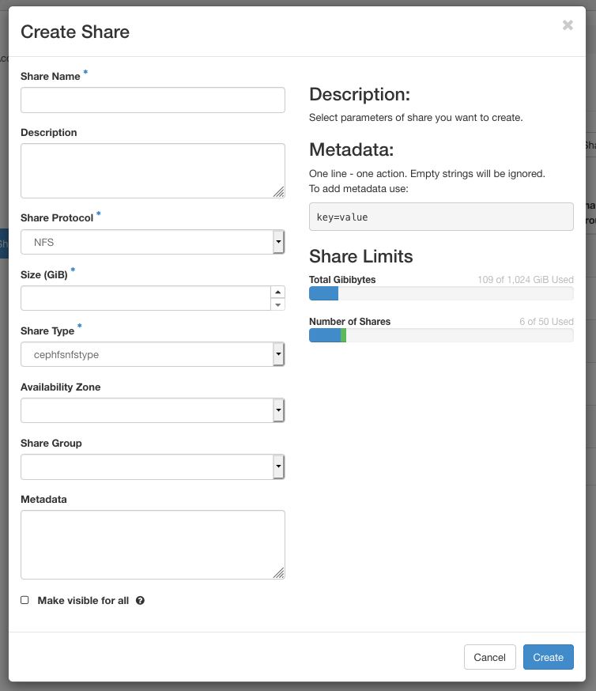

::: center

\
Last updated: DATEPLACEHOLDER

Alexander Vapirev (KU Leuven), Thomas Danckaert (UAntwerpen)

Acknowledgement: VSCentrum.be

  ------------------------------------------------- -- -- --

           
                                                          
  ------------------------------------------------- -- -- --

This document is a hands-on guide to the VSC cloud computing platform,
which relies on the open-source software
[OpenStack]{acronym-label="OpenStack" acronym-form="singular+short"}. It
should complement the official documentation at
<https://docs.openstack.org>.

For all questions concerning the VSC cloud computing platform, please
contact .

We welcome your feedback, comments and suggestions for improving the
OpenStack Tutorial

# Introduction {#introduction .unnumbered}

The VSC cloud platform uses the open-source software
[[OpenStack]{acronym-label="OpenStack"
acronym-form="singular+short"}](https://openstack.org), version "rocky".
This guide explains the specifics of the VSC environment, and provides a
hands-on introduction to OpenStack. For reference, you should consult
the OpenStack project's own documentation at
<https://docs.openstack.org>.

# Access to the VSC Cloud

Access to the VSC Cloud is linked to the central VSC account system
([account.vscentrum.be](https://account.vscentrum.be)), so you do not
need a separate login or password. In order to use the cloud services,

-   you need an active VSC account and

-   your account must be a member of one or more OpenStack projects.

New users can obtain an account by following [the procedure described
here](https://vlaams-supercomputing-centrum-vscdocumentation.readthedocs-hosted.com/en/latest/access/account_request.html).
Once you have an account, contact if you want to start a new OpenStack
project, or join an existing one.

You can interact with the VSC Cloud using the OpenStack Dashboard, a web
interface, or the OpenStack command line interface, which you can use
from any system, and which is installed for you on the UGent login node
`login.hpc.ugent.be`. You can log in to the Dashboard using the VSC
accountpage, as illustrated in the next section. To get access from the
command line interface, you'll need to obtain an application credential,
as explained in section [1.2](#sec:appl-cred){reference-type="ref"
reference="sec:appl-cred"}.

These restrictions do not apply to someone who simply wishes to access
an existing VM running in the cloud. VSC Cloud projects can decide
themselves who gets access to their VM's, and how.

## Dashboard Login {#sec:dashboard-login}

You can access the OpenStack web interface, or Dashboard, via
[cloud.vscentrum.be](https://cloud.vscentrum.be).

To log in, choose the (default) authentication method *VSC Accountpage*
and click .

From here on, follow the standard procedure to log in to your VSC
account, using your home institution's single sign-on system. You can
find a detailed description in the HPC introduction at
[hpcugent.github.io/vsc_user_docs](https://hpcugent.github.io/vsc_user_docs).
The following chapters explain how to accomplish basic tasks using the
Dashboard.

## Application Credentials {#sec:appl-cred}

If you want to use the OpenStack command line interface --- or, for
advanced users, use the OpenStack APIs directly --- you need to identify
yourself using an application credential. An application credential
contains a secret piece of information which grants access to an
OpenStack project on your behalf.

You can create an application credential using the dashboard:

1.  Log in to the dashboard, and, if you are a member of more than one
    project, select the project for which you want to create an
    application credential.

2.  Open the **Identity** tab, and click **Application Credentials**.

3.  You can now see an overview of your application credentials
    (initially none). Click **Create Application Credential**.

4.  Fill out the **Create Application Credential** dialog:

    Name, Description

    :   Choose a name (mandatory) and description that remind you of the
        purpose of this credential.

    Secret

    :   We recommend to leave this empty, in which case OpenStack will
        generate a random secret for you.

    Expiration Date, Expiration Time

    :   It is good practice make the token expire. An expiration date
        limits the impact if the secret is accidentally exposed, and you
        can always create a new credential when an old one is expired.

    Roles

    :   A role defines a set of access rights. By selecting a subset of
        roles for this credential, you can limit the access rights
        granted by this credential. It is a good idea to select only the
        minimal set of roles required for the task you want to
        accomplish.

    Click **Create Application Credential**.

5.  A summary dialog with the credential's id, name, and secret is
    displayed. If you close the window, you can't retrieve the secret
    anymore, so you should save it now. A convenient solution is to
    download the openrc file, a shell script that sets the appropriate
    environment variables for the command line interface.

The newly created credential is now shown in the overview. If you
accidentally expose a credential somewhere, you should delete it here to
prevent unauthorized access to the system.

# The OpenStack Dashboard

After login, you can see the Overview tab of
[Horizon]{acronym-label="Horizon" acronym-form="singular+short"}, the
[OpenStack Dashboard]{acronym-label="OpenStack Dashboard"
acronym-form="singular+short"}.

This chapter briefly describes the different components of the
dashboard. You can read the official documentation at
<https://docs.openstack.org/horizon/rocky/user>.

The VSC cloud uses a customized dashboard. Some features mentioned in
the official OpenStack documentation were intentionally removed, please
contact if you need access to one of these disabled features.

## Project tab {#sec:project-tab .unnumbered}

Resources (instances, data volumes, networks, ...) in OpenStack are
organized into different projects, and every user is a member of one or
more projects. Every project member has full access to all of the
project's resources.

From the Project tab, you can access the following categories:

API Access

:   View API endpoints.

Compute

:    

    -   Overview: View reports for the project.

    -   Instances: View, launch, create a snapshot from, stop, pause, or
        reboot instances, or connect to them through VNC.

    -   Images: View images and instance snapshots created by project
        users, plus any images that are publicly available. Create,
        edit, and delete images, and launch instances from images and
        snapshots.

    -   Key Pairs: View, create, edit, import, and delete key pairs.

    -   Server Groups: Server groups provide a mechanism to group
        servers according to certain policy.

Volumes

:    

    -   Volumes: View, create, edit, and delete volumes.

    -   Snapshots: View, create, edit, and delete volume snapshots.

Network

:    

    -   Networks: Create and manage public and private networks.

    -   Security Groups: View, create, edit, and delete security groups
        and security group rules..

    -   Floating IPs: Allocate an IP address to or release it from a
        project

Orchestration

:    

    -   Stacks: Use the REST API to orchestrate multiple composite cloud
        applications.

    -   Resource types: Show a list of all the supported resource types
        for HOT templates.

    -   Template versions: The version of a Heat template specifies the
        format of the template and also the corresponding features that
        will be validated and supported.

    -   Template generator: A graphical interface to build and edit
        templates.

Shares

:    

    -   Shares: Create and manage [share]{acronym-label="share"
        acronym-form="singular+short"}s.

## Identity tab {#sec:identity-tab .unnumbered}

From the Identity tab, you can access the following categories:

Projects

:   View, create, assign users to, remove users from, and delete
    projects.

Users

:   View, create, enable, disable, and delete users.

Application Credentials

:   With application credentials, a user can grant applications limited
    access to their cloud resources.

# Upload and manage images {#cha:upload-manage-images}

A virtual machine image, referred to in this document simply as an
image, is a single file that contains a virtual disk that has a bootable
operating system installed on it. Images are used to create virtual
machine instances within the cloud. The image files themselves are never
modified, but you can copy the image into a persistent instance (see
chapter [6](#cha:launch-manage-inst){reference-type="ref"
reference="cha:launch-manage-inst"}).

As a user of the VSC cloud, you can upload and manage your own virtual
machine images. For information about creating image files, see the
[*OpenStack Virtual Machine Image
Guide*](https://docs.openstack.org/image-guide/).

Shared storage in the VSC cloud is connected to a separate network,
which is only accessible from within the OpenStack environment.
Therefore, if you want to access your VM from outside of OpenStack, and
use the shared storage at the same time, you must make sure your VM
image is configured use multiple network interface cards (NICs).

You can choose who can access an image you have created. The following
access policies for images exist:

public

:   Public images are provided by the VSC, and can be accessed by all
    users.

private

:   If you create a private image, only members of the same project have
    access.

shared

:   You can also choose to share your image with a list of other
    projects.

community

:   Community images are user-created images which are freely accessible
    to all other users.

You can also use the **openstack** and **glance** command-line clients
or the Image service to manage images.

#### Upload an image

Follow this procedure to upload an image to a project:

1.  Open the Compute tab and click Images category.

2.  Click Create Image.

    The Create An Image dialog box appears.

    

3.  Enter the following values:

    Image Name

    :   Enter a name for the image.

    Image Description

    :   Enter a brief description of the image.

    Image Source

    :    

        File

        :   Browse for the image file on your file system and add it.

        Format

        :   Select the image format (for example, QCOW2) for the image.

    Image Requirements

    :    

        Architecture

        :   Specify the architecture. For example, for a 32-bit
            architecture or for a 64-bit architecture.

        Kernel, Ramdisk

        :   Can be left empty, as this is determined by the image file.

        Minimum Disk (GB), Minimum RAM (MB)

        :   Choose suitable values, according to the requirements of
            your image's operating system.

    Protected

    :   If set to , users need to unlock the image before they are able
        to delete it.

    Metadata

    :   You can add resource metadata in this tab. The glance Metadata
        Catalog provides a list of metadata image definitions.

4.  Click . The image is queued to be uploaded. It might take some time
    before the status changes from Queued to Active.

#### Update an image

Follow this procedure to update an existing image.

1.  Open the project tab and click the Images category.

2.  Select the image that you want to edit.

3.  In the Actions column, open the drop-down menu and select .

4.  In the Edit Image dialog box, you can perform various actions. For
    example:

    -   Change the name of the image.

    -   Change the description of the image.

    -   Change the format of the image.

    -   Change the minimum disk of the image.

    -   Change the minimum RAM of the image.

    -   Change the protected status of the image.

    -   Change the metadata of the image.

5.  Click .

# Instance types and flavors

VSC Tier1 Cloud provides several virtual machine instance types and
flavors to fit different use cases. Each instance type provides several
flavor sizes to give different combinations of CPU, memory, GPU and
network resources.

## Instance Types {#sec:instance-types}

The following table provides the current main instance types available
from the VSC Tier1 Cloud infrastructure:

::: {#table:instance-type}
+----------------------+----------------------+----------------------+
| **UPSv1**            | **CPUv1**            | **GPUv1**            |
+:=====================+:=====================+:=====================+
| -   AMD Epyc 7542    | -   Intel Xeon CPU   | -   AMD Epyc 7542    |
|     2.9GHz           |     E5-2670 2.60GHz  |     2.9GHz           |
|                      |                      |                      |
| -   vCPU             | -   10Gbit Ethernet  | -   25Gbit Ethernet  |
|     oversubscription |                      |                      |
|     2:1              |                      | -   1 vGPU NVIDIA    |
|                      |                      |     Tesla 4          |
| -   25Gbit Ethernet  |                      |                      |
|                      |                      |                      |
| -   Uninterruptible  |                      |                      |
|     Power Supply     |                      |                      |
|     (UPS)            |                      |                      |
+----------------------+----------------------+----------------------+

: Instance types hardware profiles
:::

Each instance type is appropriate for different workloads: () for
regular CPU usage, () for GPU computations, or () for VMs that need to
be connected to an uninterruptible power supply. VMs using UPS will keep
up and running even if the datacenter suffers an unexpected power cut.
() and () virtual machines are not supported by an UPS and will go
offline when an unexpected power cut occurs.

VSC Tier-1 Cloud instance types also provide different kind of network
performance specifications. All the instance types are able to connect
to the available networks: public network, VSC network and shared
filesystem network (NFS). Note that VSC and shared file system network
access is only made available if explicitly requested in the project
application.

VSC network gives an optimal path towards other VSC sites. This is ideal
for high performance connections between different clusters and services
within VSC. E.g. when you intend to do high data volume reshuffling
between VMs and other Tier-1 components.

Cloud projects should request VSC network if they want to connect to VSC
Data component (<https://www.vscentrum.be/data>) with iRODS and Globus
from their Tier1 Cloud VMs.

On the other hand, the shared filesystem network is required by the
OpenStack shared filesystem service (Manila) (see chapter
[10](#cha:shared-file-systems){reference-type="ref"
reference="cha:shared-file-systems"} for more information).

## Flavor Sizes {#sec:flavor-sizes}

A flavor size is a set of virtualized hardware resources to a virtual
machine (VM) instance like system memory size (RAM), virtual cores
(vCPUs) or the root filesystem size.

The flavor's root disk size is the amount of disk space used by the root
(*/*) partition, an ephemeral disk that the base image is copied into
(see section [6.1](#launch-an-instance){reference-type="ref"
reference="launch-an-instance"} for more information about VM
persistent/non-persistent instances).

The flavor's root ephemeral storage is only used when booting from a
non-persistent VM, but is not used when booting from a persistent
storage volume or persistent VM. The flavor's root ephemeral size is not
taken into account to calculate the project's local storage quota
either. You can also create a persistent volume and choose the desired
filesystem size for your persistent VM during the instantiation. VM
persistent volumes could be resized later if that is necessary (see
chapter [6](#cha:launch-manage-inst){reference-type="ref"
reference="cha:launch-manage-inst"} for more information).

VSC Tier-1 Cloud VM flavors are grouped by instance types (see table
[4.2](#table:flavor-size){reference-type="ref"
reference="table:flavor-size"}). Several flavor sizes are available for
each instance type, differing in the number of allocated vCPUs, RAM and
storage size. Every GPU flavor in addition allocates one vGPU. The
various VM flavors can be used in different combinations to fit
different workload hardware requirements.

::: {#table:flavor-size}
  **Flavor name**   **RAM**   **Root Disk**   **vCPUs**
  ----------------- --------- --------------- -----------
  CPUv1.nano        64Kb      1Gb             1
  CPUv1.tiny        512Kb     10Gb            1
  CPUv1.small       2Gb       20Gb            1
  CPUv1.medium      4Gb       30Gb            2
  CPUv1.large       8Gb       40Gb            4
  CPUv1.xlarge      16Gb      40Gb            8
  CPUv1.1_2xlarge   60Gb      40Gb            8
  CPUv1.2xlarge     60Gb      40Gb            16
  CPUv1.1_3xlarge   180Gb     80Gb            14
  CPUv1.3xlarge     120Gb     80Gb            16
  CPUv1.4xlarge     360Gb     80Gb            20
  UPSv1.small       2Gb       20Gb            1
  UPSv1.medium      4Gb       30Gb            2
  UPSv1.large       8Gb       40Gb            4
  UPSv1.2xlarge     60Gb      40Gb            16
  UPSv1.3xlarge     120Gb     80Gb            16
  GPUv1.small       2Gb       20Gb            1
  GPUv1.medium      4Gb       30Gb            2
  GPUv1.large       8Gb       40Gb            4
  GPUv1.2xlarge     60Gb      40Gb            16

  : Flavor sizes
:::

E.g. The .*large* OpenStack flavor will instantiate a VM with 4 AMD Epyc
7542 2.9GHz vCPUs, with 1 NVIDIA Tesla4 vGPU, 8GB of RAM, and a 40GB
root disk.

# Configure access and security for instances {#cha:conf-access-secur}

The security and accessibility of your cloud resources is governed by a
few different aspects, which we discuss more detail in the following
sections:

-   Instances must connect to the project's \_vm network in order to get
    external internet access (see section
    [5.1](#sec:_vm-_nfs-networks){reference-type="ref"
    reference="sec:_vm-_nfs-networks"}).

-   Each cloud project can use one floating IP, a public IP address
    which you'll need to link to the resources you want to access.
    Optionally, if the project has requested access to VSC network it
    will receive also three VSC floating IPs (see section
    [5.2](#sec:floating-ip){reference-type="ref"
    reference="sec:floating-ip"}).

-   By default, the UGent firewall blocks most IP addresses and ports.
    Only the port range 50000-60000 for the public floating IP addresses
    is open by default. Contact if you need to access other ports from
    the outside world.

-   The OpenStack environment has its own internal firewalls, which
    block most ports of your instances by default. If you want to access
    specific ports of your instances, you must create "Security Groups"
    which allow access to those ports (see section
    [5.3](#sec:security-groups){reference-type="ref"
    reference="sec:security-groups"}).

-   You can use one or more SSH keys from your VSC account to access
    your instances (see section
    [5.4](#sec:ssh-key-pairs){reference-type="ref"
    reference="sec:ssh-key-pairs"}).

For other access methods, or SSH authentication for a wider set of
users, you'll need to set up some form of identity management yourself.
This system administration task is beyond the scope of our tutorial.

## The \_vm, \_vsc and \_nfs networks {#sec:_vm-_nfs-networks}

Each project in the VSC cloud has its own network *`<projectname>`*`_vm`
and --- if the project uses shares and/or vsc networks ---
*`<projectname>`*`_nfs` and *`<projectname>`*`_vsc` respectively. Each
is a subnet of 254 addresses, with an ip range 10.10.$x$.0/24, where $x$
is a number that depends on the project and network. To see the subnets
for your project's networks, open the Network tab, and select Networks.

Instances should use the \_vm network for communication, and the \_nfs
network if they need access to shared file systems (see chapter
[10](#cha:shared-file-systems){reference-type="ref"
reference="cha:shared-file-systems"}). On the other hand \_vsc network
is used to connect to or provide VSC services via VSC network and
floating IPs. When an instance is created in
[OpenStack]{acronym-label="OpenStack" acronym-form="singular+short"} and
connected to the \_vm, \_nfs or \_vsc networks, it is automatically
assigned a fixed IP address in that network. This IP address is
permanently associated with the instance until the instance is
terminated.

## Floating IP addresses {#sec:floating-ip}

The \_vm, \_nfs and \_vsc networks can only be reached from within the
OpenStack environment. If you need to access an instance from the
outside, you need to use one of your project's floating IP addresses,
which are public IP addresses (193.190.80.0/25 IPs for \_vm network) or
VSC IP addresses (172.24.48.0/20 IPs for \_vsc network). Unlike fixed IP
addresses, floating IP addresses can have their associations modified at
any time, regardless of the state of the instances involved.

Do not release the floating IPs assigned to your project. The floating
IPs are fixed to the project and it is not possible, as regular user, to
re-allocate floating IPs. Please contact to VSC Tier1 Cloud support if
you have released your project's floating IPs by mistake.

This section explains how to make your instance accessible via a public
IP address by two different methods. The preferred method for \_vm
network is to use port forwarding to access multiple instances using the
same public IP address, but you can also use a "floating IP association"
for quick tests or \_vsc network.

### Floating ip port forwarding {#port-forwarding .unnumbered}

OpenStack's networking API, called Neutron, makes it possible to forward
different ports of the same floating ip to arbitrary ports in one of
OpenStack's virtual networks. This is the recommended way to use
floating ip's in the VSC cloud. For the floating IP's available in the
VSC Cloud, the high port range 50000-60000 is open to the outside world,
so it is most convenient to work with ports from this range. Contact if
you need public access to another port for a specific ip address.

You'll need to forward a separate port for every service you wish to
reach. For example, if you want to access an instance using SSH, you'll
need to create a port forwarding rule from a selected port of the
floating IP, to the port in the \_vm network where your instance's SSH
server is listening (typically port 22).

You can quickly set up such forwarding rules using
`neutron_port_forward`, a command line tool available on the UGent login
node, `login.hpc.ugent.be`. In order to use it, you must create an
application credential for the role "User", and save it as an openrc
file (see section [1.2](#sec:appl-cred){reference-type="ref"
reference="sec:appl-cred"} on page ). Transfer the openrc file to your
VSC storage space, so `neutron_port_forward` can read it. To set up new
port forwarding rules, run the script providing the path to the openrc
file as an argument to the `-o` option, and a file describing your port
forwarding configuration as argument to the `-m` option:

::: prompt
:::

The following is an example configuration file:

::: code
\[DEFAULT\] floatingip=193.190.85.40 network=\_vm

\[classa\] pattern=classa-(+̣) 22=52000:100:22 5900=55900

\[classb\] pattern=classb-(+̣) 80=52080
:::

Here we define defaults for the floating ip and target network, and two
classes. Instances are assigned to a class if their name matches the
regular expression given in `pattern`. The value of `pattern` must be a
valid Python regular expression, and the first capturing group (if any)
must match an integer.

Port forwarding rules are given in the form
`target=source(:multiplier:offset)`. This will set up a forwarding rule
from the floating IP port

$$(\mathrm{source} + \mathrm{multiplier} * i + \mathrm{offset}) \rightarrow \mathrm{target}\, ,$$

where $i$ is the integer matched by the first capturing group, and
"target" is a port of the fixed IP for the instance in the chosen
network, in this case the \_vm network. "multiplier" and "offset" are
optional and default to 1 and 0 respectively. In our example, this
results in the following set of port forwarding rules for the public IP
address 193.190.85.40:

::: center
  ------- -------------------------------
  52122   $\rightarrow$   classa-1:22
  52222   $\rightarrow$   classa-2:22
  ...     $\rightarrow$  
  55901   $\rightarrow$   classa-1:5900
  55902   $\rightarrow$   classa-2:5900
  ...     $\rightarrow$  
  52081   $\rightarrow$   classb-1:80
  52082   $\rightarrow$   classb-2:80
  ...     $\rightarrow$  
  ------- -------------------------------
:::

This is another basic port forwarding configuration example without
patterns, in this case just to connect via SSH using external port 52000
to a running VM called testvm:

::: code
\[DEFAULT\] floatingip=193.190.85.40 network=\_vm

\[testvm\] 22=52000
:::

You can also see an overview of existing port forwarding rules for the
ip addresses in your configuration file using
`neutron_port_forward --show`. Each rule has an internal id, which you
can see if you combine the options `--show` and `--id` as follows:

::: prompt
:::

To remove port forwarding rules, use the option
`--remove=<list of id's>` with a comma-separated list of the id's of the
rules you want to remove.

Please note that when you remove and reinstantiate a VM, OpenStack also
removes the port forwarding rules assigned to this VM automatically. If
you intantiate again the same VM you should run `neutron_port_forward`
and restore the port forwarding rules.

`neutron_port_forward` provides a few more options and advanced
features, run the command with the `--help` option for more information.

### Associate a floating ip {#associate-a-floating-ip .unnumbered}

A floating IP address can also be associated to an instance, just like
the fixed IP addresses. Because this approach uses one of the few
available floating ip addresses for every instance you want to connect
to, you should only use it for testing purposes with \_vm network or
with \_vsc network.

If you want to use a floating ip for port forwarding as in the previous
section, it cannot be associated to an instance at the same time.

Use the following procedure to associate that address with a specific
instance.

1.  Open the Network tab.

2.  Click the Floating IPs tab, which shows the floating IP addresses
    allocated to your project.

3.  In the Floating IPs list, click Associate next to the address you
    want.

4.  In the Manage Floating IP Associations dialog box, choose the
    following options:

    IP Address

    :   This field is filled automatically.

    Port to be associated

    :   Select a port from the list. The list shows all the instances
        with their fixed IP addresses.

5.  Click Associate.

Another way to associate a floating IP is after the user has already
launched an instance which appears in the list of running instances in
the Project--\>Compute--\>Instances tab:

1.  Expand the drop-down menu on right next to the instance

2.  Select Associate Floating IP

    

3.  A pop-up window will appear and under IP Address select from the
    drop-down menu an IP address from the available pool.

    

4.  Click Associate

If the IP has been successfully associated in the upper right corner of
the browser screen will appear a green confirmation. If not successful a
red notification will pop up that something went wrong.

To disassociate an IP address from an instance, click the Disassociate
button in the Actions column.

*Do not* use the Release Floating IP option in the Actions column or on
the overview page. This will remove the floating IP from the pool
assigned to your project, something which you, as a regular user, cannot
undo. If you've accidentally released a floating IP, contact to have it
restored.

## Security Groups {#sec:security-groups}

OpenStack security groups are sets of IP filter rules that define
networking access. You can then assign one or more security groups to
your instances.

In the VSC cloud, each project contains a default security group, which
allows you to ping instances and connect using SSH on the default port
22. If you want to access other ports on your instances, create new
security groups with the appropriate rules and assign them to the
instances.

## SSH key pairs {#sec:ssh-key-pairs}

When an instance is launched, OpenStack can automatically install a
public SSH key on it, so as to give anyone with the corresponding
private key admin access. For this "key pair injection[^1]" to work, the
image that the instance is based on must contain the **cloud-init**
package, or have in place another mechanism in place that will interact
with the OpenStack metadata server to install the appropriate key. For
general instructions on SSH keys, we refer to chapter 2 of our
[introduction to HPC](https://hpcugent.github.io/vsc_user_docs).

If you have generated a key pair with an external tool, you can import
it into OpenStack. The key pair can be used for multiple instances that
belong to a project. For more information, see section
[\[import-a-key-pair\]](#import-a-key-pair){reference-type="ref"
reference="import-a-key-pair"}.

The public keys from your VSC account are automatically available in
your VSC Cloud projects, so you can immediately inject one of your
existing into your instances. Of course, you can also import new keys
into OpenStack, which are not coupled to your VSC account. If you want
to give other parties SSH access to VM's, you must manage the keys using
some other method. upload SSH keys for other users to your VSC account.

Every OpenStack user account has its own collection of SSH keys for
every project. To share a public key between multiple users of the same
project, each user needs to import it in the OpenStack project.

### Add a key pair {#add-a-key-pair .unnumbered}

1.  Open the Compute tab.

2.  Click the Key Pairs tab, which shows the key pairs that are
    available for this project.

3.  Click Create Key Pair.

4.  In the Create Key Pair dialog box, enter a name for your key pair,
    and click Create Key Pair.

5.  Respond to the prompt to download the key pair.

6.  Save the **\*.pem** file locally.

7.  To change its permissions so that only you can read and write to the
    file, run the following command:

    ::: prompt
    :::

    If you are using the
    [OpenStack Dashboard]{acronym-label="OpenStack Dashboard"
    acronym-form="singular+short"} from a Windows computer, use PuTTYgen
    to load the **\*.pem** file and convert and save it as **\*.ppk**.
    For more information see the [*WinSCP web page for
    PuTTYgen*](https://winscp.net/eng/docs/ui_puttygen), and chapter 2
    of the [introduction to HPC at
    VSC](https://hpcugent.github.io/vsc_user_docs).

8.  To make the key pair known to SSH, run the **ssh-add** command.

    ::: prompt
    :::

### Import a key pair {#import-a-key-pair .unnumbered}

1.  Open the Compute tab.

2.  Click the Key Pairs tab, which shows the key pairs that are
    available for this project.

3.  Click Import Key Pair.

4.  In the Import Key Pair dialog box, enter the name of your key pair,
    copy the public key into the Public Key box, and then click Import
    Key Pair.

The Compute database registers the public key of the key pair.

The [OpenStack Dashboard]{acronym-label="OpenStack Dashboard"
acronym-form="singular+short"} lists the key pair on the Key Pairs tab.

# Launch and manage instances {#cha:launch-manage-inst}

Instances are virtual machines that run inside the cloud. You can launch
an [instance]{acronym-label="instance" acronym-form="singular+short"}
from the following sources:

-   Images uploaded to the Image service.

    Because images are read-only, any changes made while the instance is
    running will be lost when the instance is deleted, unless you choose
    to create a persistent volume for your instance when you launch it.
    Using a volume, the VM's state is saved, even when the current
    instance is deleted.

-   Images which you previously copied to a persistent volume. The
    instance launches from the volume.

-   Instance snapshots.

## Launch an instance

1.  Open the Compute tab and select the Instances category.

    The dashboard shows the list of existing instances with their name,
    IP addresses, flavor, status, power state, ...

2.  Click .

3.  In the Launch Instance dialog box, specify the following values:

    

    Details

    :   tab

        Instance Name

        :   Assign a name to the virtual machine.

            The name you assign here becomes the initial host name of
            the server. If the name is longer than 63 characters, the
            Compute service truncates it automatically to ensure dnsmasq
            works correctly.

            After the server is built, if you change the server name in
            the API or change the host name directly, the names are not
            updated in the dashboard.

            Server names are not guaranteed to be unique when created so
            you could have two instances with the same host name.

        Description

        :   You can assign a brief description of the virtual machine.

        Availability Zone

        :   Large-scale OpenStack systems may consist of multiple
            availability zones, which are groups of hypervisors
            connected to different power sources. By assigning instances
            to different availability zones, users can protect
            themselves against power failures. However, the VSC cloud
            consists of just a single zone, called .

        Count

        :   To launch multiple instances, enter a value greater than .
            The default is .

        

    Source

    :   tab

        Select Boot Source

        :   Your options are:

            Image

            :   

            Image snapshot

            :   

            Volume

            :   

            Volume snapshot

            :   

            Depending on the type of boot source, the list of available
            items changes.

        Create New Volume

        :   If you enable this option when launching from an image or
            instance snapshot, the image or snapshot will be copied to a
            volume. This way, the state of your instance persists after
            shutdown and reboot.

    Flavor

    :   tab. Specify the size of the instance to launch.

        The flavor is selected based on the size of the image selected
        for launching an instance. For example, while creating an image,
        if you have entered the value in the Minimum RAM (MB) field as
        2048, then on selecting the image, the default flavor is (see
        section [4.1](#sec:instance-types){reference-type="ref"
        reference="sec:instance-types"} for more information). If a '!'
        warning sign is displayed next to a resource for one of the
        flavors, that means that this flavor would exceed the project's
        quota for that resource, and therefore is not available.

    Networks

    :   tab. Add one or more networks to the instance.

    Network Ports

    :   tab. Activate the ports that you want to assign to the instance.

    Security Groups

    :   tab. Activate the security groups that you want to assign to the
        instance.

        Security groups are a kind of cloud firewall that define which
        incoming network traffic is forwarded to instances. See section
        [5](#cha:conf-access-secur){reference-type="ref"
        reference="cha:conf-access-secur"} on page   for more
        information.

        The default security group is assigned to the instance
        automatically.

    Key Pair

    :   tab. Specify a key pair.

        If the image uses a static root password or a static key set
        (neither is recommended), you do not need to provide a key pair
        to launch the instance.

    Configuration

    :   tab. Specify a customization script that runs after your
        instance launches.

    Server Groups

    :   tab. You can organize instances into groups with a scheduling
        policy. With an "affinity" policy, OpenStack will try to
        schedule those instances on the same hypervisors, which is
        useful for instances that need to communicate with each other a
        lot. With an "anti-affinity" policy, instances will be scheduled
        on different hypervisors, which you might use for instances that
        provide redundant copies of a single service.

    Scheduler Hints

    :   tab. By providing scheduler hints, you can get more fine grained
        control over which hypervisor your instances are scheduled on.

    Metadata

    :   tab. Add Metadata items to your instance.

4.  Click .

The instance starts on a compute node in the cloud.

If you did not provide a key pair, security groups, or rules, users can
access the instance only from inside the cloud through VNC. Even pinging
the instance is not possible without an ICMP rule configured.

You can also launch an instance from the Images or Volumes category when
you launch an instance from an image or a volume respectively.

When you launch an instance from an image, OpenStack creates a local
copy of the image on the compute node where the instance starts.

For details on creating images, see [*Creating images
manually*](https://docs.openstack.org/image-guide/create-images-manually.html)
in the *OpenStack Virtual Machine Image Guide*.

## Connect to an instance using SSH {#connect-to-your-instance-using-ssh}

Before you can connect to an instance using SSH, you must set up a
floating IP for it, as discussed in
section [5.2](#sec:floating-ip){reference-type="ref"
reference="sec:floating-ip"}. Recall that only ports 50000 to 60000 of
the floating IP's can be directly reached from outside the UGent
network.

When you try to connect to a new instance using a port that was
previously forwarded to a different instance --- either due to a change
in the port forwarding configuration, or because an old instance was
deleted and replaced --- your SSH client will show an error message
because the "host key" of the new instance doesn't match the known
previous key. Section explains how to handle such errors.

If you want to access ports outside the public range, you'll need to
connect to the UGent login node `login.hpc.ugent.be` first, and hop to
your instance from there. To make this work without storing the required
private key for the instance in your VSC storage space, you need to set
up an SSH agent with key forwarding locally, i.e. on the machine where
you store the private key of an authorized keypair for the instance.
Section 2.1.4 of the HPC introduction explains how to set this up
([hpcugent.github.io/vsc_user_docs](https://hpcugent.github.io/vsc_user_docs)).

0.  (*Only if using a port blocked by the UGent firewall, see the note
    above:*) Use your VSC account to connect to the UGent login node,
    using the `ssh -A` option to enable agent forwarding:

    ::: prompt
    :::

1.  Copy the address of the floating IP where your instance can be
    reached. In our example, the address is 193.190.85.40.

2.  Connect to the instance. Use OpenSSH's `-p` option to specify the
    port where the instance's SSH server can be reached, e.g. for port
    50022:

    ::: prompt
    :::

    When you run the above command, your SSH client may display warnings
    or error messages. The section explains the meaning of these
    messages and how you should deal with them.

    The images we provide do not allow SSH logins for the root user.
    There is a default user instead, who can get administrative
    privileges using `sudo`. In our example, we have used the username
    `ubuntu` for Ubuntu images. Attempting to log in as root will return
    an error message with the proper user name.

### Host keys {#sec:host-keys .unnumbered}

When connecting to instances using SSH, you will sometimes see warnings
or errors related to "host keys". This section briefly explains the
meaning of those errors, and how to deal with them.

When you try to connect to an instance, you use the private key of your
SSH keypair to prove your identity to that instance. If you do not have
access to the right secret key, you can not prove your identity, at
which point the your instance's SSH server will deny access. In the same
way, the server must prove its own identity to you, using its own
keypair or "host key". Without such a verification procedure, third
parties on the network between you and the instance could perform a
so-called man-in-the-middle-attack, where they intercept the
communication between you and the server you want to reach and steal
valuable information.

To prevent such man-in-the-middle attacks, the SSH client on your system
stores the host key for every IP address you have connected to, and
verifies the key the next time you try to connect to that address. If
all goes well, this check is silently performed in the background, but
there are a number of situations where the check fails. In this case,
you have to look up the host key of your instance in the OpenStack
dashboard to verify that the connection is secure.

#### Looking up an instance's host key {#sec:look-up-hostkey .unnumbered}

In order to verify a host key, it suffices to compare the key's
fingerprint, a short alphanumerical sequence computed from the keys
content. You can use the Dashboard to look up the host key fingerprint
for an instance as follows:

1.  Open the Compute tab and select the Instances category.

2.  Click on the name of the instance you want to connect to.

3.  Click

    

4.  Click . You are taken to a new page with a long text listing.

5.  Search for the words `-----BEGIN SSH HOST KEY FINGERPRINTS-----` to
    find the log file section containing the host key fingerprints, for
    example:

    ::: code
    \<14\>Jun 6 09:57:01 ec2:
    \#############################################################
    \<14\>Jun 6 09:57:01 ec2: -----BEGIN SSH HOST KEY FINGERPRINTS-----
    \<14\>Jun 6 09:57:01 ec2: 1024
    SHA256:gCa0hZAaOnpzxYM5WnAZINuZTI5NAoqd41U/dtxeGKE root@my-instance
    (DSA) \<14\>Jun 6 09:57:01 ec2: 256
    SHA256:nyujUIF37c674FPSkDdz0xgAU6S39UWbmMzBPmdmCmg root@my-instance
    (ECDSA) \<14\>Jun 6 09:57:01 ec2: 256
    SHA256:Mcznquek1A3BFz6KEXSxsivpdkX1mY3LnymEA7C8Xxg root@my-instance
    (ED25519) \<14\>Jun 6 09:57:01 ec2: 2048
    SHA256:4DagYc9cZvANkSjbTL0pB+3ULqHg09zW4E8wvDrB4Do root@my-instance
    (RSA) \<14\>Jun 6 09:57:01 ec2: -----END SSH HOST KEY
    FINGERPRINTS----- \<14\>Jun 6 09:57:01 ec2:
    \#############################################################
    :::

In this example, the fingerprints are character sequences starting with
"SHA256", such as the ECDSA key fingerprint
`SHA256:nyujUIF37c674FPSkDdz0xgAU6S39UWbmMzBPmdmCmg`. The following
sections describe the most common cases where you'll need these
fingerprints.

The following examples show output and commands for OpenSSH, the most
common client on Linux and macOS. If you are working from a windows
system using using PuTTY, we refer to sections 8.4 and 8.6 of the
windows version of the [introduction to
HPC](https://hpcugent.github.io/vsc_user_docs) for the corresponding
warning messages.

#### Connecting for the first time {#sec:conn-first-time .unnumbered}

The first time you connect to a new ip address:port combination, your
SSH client does not know the host key for this address, and therefore it
can't verify the identity of the server. When using OpenSSH, the warning
looks as follows (again using address 193.190.85.40 and port 50022 as an
example):

::: prompt
The authenticity of host '\[193.190.85.40\]:50022
(\[193.190.85.40\]:50022)' can't be established. ECDSA key fingerprint
is SHA256:nyujUIF37c674FPSkDdz0xgAU6S39UWbmMzBPmdmCmg. Are you sure you
want to continue connecting (yes/no)?
:::

Verify the fingerprint in order to make sure that it is safe to proceed:

1.  Look up the fingerprint of the instance you want to access,
    according to the procedure described in the section .

2.  Verify that the fingerprint you find in the Dashboard matches the
    fingerprint shown in the warning message.

    In this example, we see that the ECDSA key fingerprint reported by
    the SSH client matches the fingerprint of our instance from the
    previous section, namely

    `SHA256:nyujUIF37c674FPSkDdz0xgAU6S39UWbmMzBPmdmCmg`.

3.  If the fingerprints are identical, type "yes" to log in.

#### New instance at a known address

Another case where the host key verification fails, is when you try to
access a new instance at an IP address and port previously used by
another instance. This can happen if you modify your port forwarding
configuration, or if a running instance connected to a certain port is
deleted and replaced by a new one. In this case, OpenSSH will show a
warning such as this:

::: prompt
@@@@@@@@@@@@@@@@@@@@@@@@@@@@@@@@@@@@@@@@@@@@@@@@@@@@@@@@@@@ @ WARNING:
REMOTE HOST IDENTIFICATION HAS CHANGED! @
@@@@@@@@@@@@@@@@@@@@@@@@@@@@@@@@@@@@@@@@@@@@@@@@@@@@@@@@@@@ IT IS
POSSIBLE THAT SOMEONE IS DOING SOMETHING NASTY! Someone could be
eavesdropping on you right now (man-in-the-middle attack)! It is also
possible that a host key has just been changed. The fingerprint for the
ECDSA key sent by the remote host is
SHA256:hI2HcqFxsCKwEauq2QvBmgDN4nCPjllaRsYoCb7tJQw. Please contact your
system administrator. Add correct host key in \[\...\]/.ssh/known_hosts
to get rid of this message. Offending ECDSA key in
\[\...\]/.ssh/known_hosts:57 ECDSA host key for \[193.190.85.40\]:50322
has changed and you have requested strict checking. Host key
verification failed.
:::

The file `known_hosts` in your OpenSSH configuration directory contains
a list of all hosts you have previously connected to, together with
their host keys. The warning above tells you that the server you are
connecting to is not using the same key anymore. In this case, you
should take the following steps:

## Track usage for instances

You can track usage for instances for each project. You can track costs
per month by showing meters like number of vCPUs, disks, RAM, and uptime
for all your instances.

1.  Open the Compute tab and select the Overview category.

2.  To query the instance usage for a period of time, select a time
    range and click .

3.  To download a summary, click .

## Create an instance snapshot

1.  Open the Compute tab and select the Instances category.

2.  Select the instance from which to create a snapshot.

3.  In the actions column, click .

4.  In the Create Snapshot dialog box, enter a name for the snapshot,
    and click .

The Images category shows the instance snapshot.

To launch an instance from the snapshot, select the snapshot and click
Launch. Proceed with launching an instance.

## Manage an instance

1.  Open the Compute tab and select the Instances category.

2.  Select an instance.

3.  In the menu list in the actions column, select the state.

    You can resize or rebuild an instance. You can also choose to view
    the instance console log, edit instance or the security groups.
    Depending on the current state of the instance, you can pause,
    resume, suspend, soft or hard reboot, or terminate it.

### Difference between *suspend*, *pause*, *shelve*, *shut off*, *delete* {#server-power-down-states .unnumbered}

Pause

:   Stores the state of the VM in the (RAM) memory.

Suspend

:   Stores the state of the VM on the disk, all memory is written to
    disk, and the server is stopped.

Shut off

:   The server is powered down by the user, either through the OpenStack
    Compute API, or from within the server by issuing a *shutdown -h*
    command. In this state the user retains all computational resources
    associated with the VM. The instance can be later restarted.

Shelve

:   Shelving stops the instance and takes a snapshot of it. Then
    depending on the value of the *shelved_offload_time* config option,
    the instance is either deleted from the hypervisor (0), never
    deleted (-1), or deleted after some period of time (\> 0). Shelve
    preserves all associated data and VM resources but does not retain
    anything in memory.

Delete

:   The VM is deleted and removed from
    [OpenStack]{acronym-label="OpenStack" acronym-form="singular+short"}
    together with any associated processes and resources. However, for
    instances backed by a persistent volume, this volume is not deleted.
    When such an instance is deleted, you can restore it by launching a
    new instance from the volume, or delete the volume as well (see
    section [7.0.0.6](#delete-a-volume){reference-type="ref"
    reference="delete-a-volume"}).

For more details see the OpenStack documentation on [*Virtual Machine
States and
Transitions*](https://docs.openstack.org/nova/rocky/reference/vm-states.html)
and [*Server
concepts*](https://developer.openstack.org/api-guide/compute/server_concepts.html).

# Create and manage volumes

An [OpenStack Volume]{acronym-label="OpenStack Volume"
acronym-form="singular+short"} is a block storage device which you
attach to instances to enable persistent storage. You can attach a
volume to a running instance or detach a volume and attach it to another
instance at any time. You can also create a snapshot from a volume, or
delete it.

#### Create a volume

1.  Open the Volumes tab and select the Volumes category.

2.  Click .

    In the dialog box that opens, enter or select the following values.

    Volume Name

    :   Specify a name for the volume.

    Description

    :   Optionally, provide a brief description for the volume.

    Volume Source

    :   Select one of the following options:

        -   No source, empty volume: Creates an empty volume. An empty
            volume does not contain a file system or a partition table.

        -   Snapshot: If you choose this option, a new field for Use
            snapshot as a source displays. You can select the snapshot
            from the list.

        -   Image: If you choose this option, a new field for Use image
            as a source displays. You can select the image from the
            list.

        -   Volume: If you choose this option, a new field for Use
            volume as a source displays. You can select the volume from
            the list. Options to use a snapshot or a volume as the
            source for a volume are displayed only if there are existing
            snapshots or volumes.

    Type

    :   Select one of the following options:

        -   tripleo: This is the default option for the projects, it
            creates the volume in a regular hdd storage pool.

        -   fastpool (optional): It creates the volume in a high I/O
            throughput storage pool. Fastpool has its own storage quota
            and it is only accessible by project's request (contact if
            you need more information).

    Size (GB)

    :   The size of the volume in gibibytes (GiB).

    Availability Zone

    :   Select the Availability Zone from the list. By default, this
        value is set to the availability zone given by the cloud
        provider (for example, or ). For some cases, it could be .

3.  Click .

The dashboard shows the volume on the Volumes tab.

#### Attach a volume to an instance

After you create one or more volumes, you can attach them to instances.
You can attach a volume to one instance at a time.

1.  Open the Volumes tab and click Volumes category.

2.  Select the volume to add to an instance and click .

3.  In the Manage Volume Attachments dialog box, select an instance.

4.  Enter the name of the device from which the volume is accessible by
    the instance.

    The actual device name might differ from the volume name because of
    hypervisor settings.

5.  Click .

    The dashboard shows the instance to which the volume is now attached
    and the device name.

You can view the status of a volume in the Volumes tab of the dashboard.
The volume is either Available or In-Use.

Now you can mount, format, and use the volume from this instance.

#### Detach a volume from an instance

1.  Open the Volumes tab and select the Volumes category.

2.  Select the volume and click .

3.  Click and confirm your changes.

A message indicates whether the action was successful.

#### Create a snapshot from a volume

1.  Open the Volumes tab and select the Volumes category.

2.  Select a volume from which to create a snapshot.

3.  In the Actions column, click .

4.  In the dialog box that opens, enter a snapshot name and a brief
    description.

5.  Confirm your changes.

The dashboard shows the new volume snapshot in Volume Snapshots tab.

#### Edit a volume

1.  Open the Volumes tab and select the Volumes category.

2.  Select the volume that you want to edit.

3.  In the Actions column, click .

4.  In the Edit Volume dialog box, update the name and description of
    the volume.

5.  Click .

You can extend a volume by using the Extend Volume option available in
the More dropdown list and entering the new value for volume size.

#### Delete a volume

When you delete an instance, the data in its attached volumes is not
deleted.

1.  Open the Volumes tab and select the Volumes category.

2.  Select the check boxes for the volumes that you want to delete.

3.  Click and confirm your choice.

A message indicates whether the action was successful.

# Orchestration Using Heat {#cha:orch-using-heat}

[Heat]{acronym-label="Heat" acronym-form="singular+short"} is the name
of the OpenStack orchestration engine, which can manage complete
configurations of all servers, volumes, users, networks and routers that
make up a cloud application. Instead of managing every component
separately, we can create, start, stop or clean up our complete
application in a single step. In OpenStack, such a collection of
resources is called a [stack]{acronym-label="stack"
acronym-form="singular+short"}.

[Heat]{acronym-label="Heat" acronym-form="singular+short"} has its own
dashboard interface, which you can find under the tab. Official
documentation for Heat and its dashboard interface can be found at the
following locations:

-   <https://docs.openstack.org/heat/rocky>

-   <https://docs.openstack.org/heat-dashboard/rocky>

## [Heat Orchestration Template]{acronym-label="Heat Orchestration Template" acronym-form="singular+short"}s {#sec:glsh-orch-templ}

A [stack]{acronym-label="stack" acronym-form="singular+short"}'s
resources and their mutual dependencies can be specified in a text file,
called a
[Heat Orchestration Template]{acronym-label="Heat Orchestration Template"
acronym-form="singular+short"} ([hot]{.smallcaps}). The syntax of these
templates conforms to the [yaml]{acronym-label="yaml"
acronym-form="singular+short"} standard, for which many text editors
provide specialized editing modes. The '[Template
Guide](https://docs.openstack.org/heat/rocky/template_guide)' in the
Heat documentation contains a specification of the [hot]{.smallcaps}
format, as well as information on how to describe the various types of
resources in a template.

[vsc]{.smallcaps} provides some example templates at
[github.com/hpcugent/openstack-templates](https://github.com/hpcugent/openstack-templates),
which can serve as a starting point for your own templates, or as
examples.

The following example describes a stack consisting of a single VM:

::: code
heat_template_version: 2018-08-31

description: This template instantiates a basic VM.

parameters: user_key: type: string label: ssh_user_key description:
Public user ssh key to be injected in the cluster VMs constraints: \[
custom_constraint: nova.keypair \] vm_flavour: type: string label:
vm_flavour description: Flavour for the VM constraints: \[
custom_constraint: nova.flavor \] vm_image: type: string label: vm_image
description: Required VM image constraints: \[ custom_constraint:
glance.image \] user_network: type: string label: user_network
description: Add the required VM network constraints: \[
custom_constraint: neutron.network \]

resources: my_server: type: OS::Nova::Server properties: name: MyServer
metadata: server: master color: red security_groups: \[ default \]
networks: \[ network: get_param: user_network \] key_name: get_param:
user_key image: get_param: vm_image flavor: get_param: vm_flavour
:::

Our example contains four main sections:

`heat_template_version`

:   The [hot]{.smallcaps} specification has evolved since its initial
    release. The key `heat_template_version` indicates the version of
    the syntax used in this template. It's value can be a release date
    or (in recent version) the name of the version.

`description`

:   Providing a description is optional, but recommended.

`parameters`

:   Another optional section, `parameters` allow users to configure
    various properties when instantiating a new stack, without having to
    edit the template itself. A parameter value can be used elsewhere in
    the template using the function `get_param`. In this example, we use
    parameters to choose an SSH key, instance size ("flavor"), image,
    and a network.

`resources`

:   This section contains all the resources used by the Stack. In this
    case, there is just a single VM instance (OS::Nova::Server).

Optional additional sections are , , and .

## The Template Generator {#sec:template-generator}

The Heat dashboard provides a graphical interface where users can draw
templates by dragging resources onto a canvas, and connecting them.
Users can then download a template generated from this interface, or
immediately instantiate it as a stack.

Currently, there are a number of issues with the template generator,
which require manual edits to the generated templates. Therefore, the
template generator is currently not very useful. We will update this
section as soon as these problems are solved.

## Managing stacks {#sec:managing-stacks}

The button in the tab takes you to the overview page where you can
launch, suspend, resume and delete stacks.

The overview page contains a list of all currently existing stacks
(either running or suspended), and buttons to perform the following
actions:

### Launch a stack {#launch-a-stack .unnumbered}

1.  Click to open the following wizard:

    

2.  Provide a template and --- optionally --- an environment for the
    stack.

    Template Source

    :   You can provide a template using one of the following options:

        File

        :   Provide a local file on your system.

        Direct Input

        :   Enter the template in a text field.

        URL

        :   Provide a [URL]{.smallcaps} to have OpenStack download the
            template from that location.

        In our example, we provide a [URL]{.smallcaps} from the
        repository
        [github.com/hpcugent/openstack-templates](https://github.com/hpcugent/openstack-templates),
        to instantiate the example from section
        [8.1](#sec:glsh-orch-templ){reference-type="ref"
        reference="sec:glsh-orch-templ"}. If you want to provide a
        template directly from GitHub, make sure to provide a "Raw"
        [URL]{.smallcaps}, `https://raw.githubusercontent.com/`....

    Environment Source

    :   Optionally, you can also provide an environment file. This is
        another [yaml]{.smallcaps} file, which contains customizations
        for your Heat templates, such as default values for parameters,
        or custom resource types you have created (see
        '[Environments](https://docs.openstack.org/heat/rocky/template_guide/environment.html)'
        in the Heat template guide). You can provide a or choose .

3.  If you click , OpenStack will process the template. You can now
    enter a name for the stack, and provide values for all the template
    parameters:

    

4.  Click to instantiate the stack.

### Preview Stack {#preview-stack .unnumbered}

starts a wizard similar to the "Launch Stack" wizard, but completing the
wizard will only make the system perform a sanity check of your
template, without instantiating the stack. If the check passes, you can
inspect the parameters of the stack that would be created. The wizard
does not allow you to enter input parameter values, so any mandatory
input parameters should be provided in an environment.

### Delete Stacks {#delete-stacks .unnumbered}

deletes all selected stacks from the list .

Deleting a stack also deletes all of the resources (volumes, ports)
created by that stack, unless a different policy was set in the property
for those resources (see the '[Resources
section](https://docs.openstack.org/heat/rocky/template_guide/hot_spec.html#resources-section)'
in the [hot]{.smallcaps} specification).

### More Actions {#more-actions .unnumbered}

The button hides the following additional actions:

::: description
verifies if the resources for selected stacks are still running.

suspends all resources of the selected stacks.

resumes the selected (suspended) stacks.
:::

You can quickly suspend, resume or delete a single stack using the
drop-down menu in the column of the overview. This menu also contains
the option , which allows you to update a Stack by providing a new
template.

# Orchestration Using Terraform {#cha:orch-using-terraform}

HashiCorp [Terraform]{acronym-label="Terraform"
acronym-form="singular+short"} <https://www.terraform.io/> is an
infrastructure as code tool (IaC), similar to OpenStack
[Heat]{acronym-label="Heat" acronym-form="singular+short"} orchestrator
(See chapter [8](#cha:orch-using-heat){reference-type="ref"
reference="cha:orch-using-heat"}). Users can deploy a data center
infrastructure using a declarative configuration language known as
HashiCorp Configuration Language (HCL), or using JSON.
[Terraform]{acronym-label="Terraform" acronym-form="singular+short"} has
some advantages over OpenStack [Heat]{acronym-label="Heat"
acronym-form="singular+short"} service. It is has a simple syntax, it
can provision virtual infrastructures across multiple cloud providers
(not only OpenStack) and it provides important features not supported by
[Heat]{acronym-label="Heat" acronym-form="singular+short"} at this
moment, like network port forwarding rules (see
[5.2](#sec:floating-ip){reference-type="ref"
reference="sec:floating-ip"}). This means that with Terraform, scripts
like `neutron_port_forward` (see
[\[port-forwarding\]](#port-forwarding){reference-type="ref"
reference="port-forwarding"}) are no longer needed.

[Terraform]{acronym-label="Terraform" acronym-form="singular+short"} is
currently one of the most popular infrastructure automation tools
available. VSC Cloud also provides some template examples that could be
used to deploy virtual infrastructures within VSC Tier-1 Cloud in an
automated way
(<https://github.com/hpcugent/openstack-templates/tree/master/terraform>).

[Terraform]{acronym-label="Terraform" acronym-form="singular+short"}
client is available for different Operating Systems like Windows, Linux
or macOS (<https://www.terraform.io/downloads>) but it is also available
from UGent login node `login.hpc.ugent.be`.

## Create application credentials for Terraform {#sec:app-cred-terraform}

[Terraform]{acronym-label="Terraform" acronym-form="singular+short"}
uses OpenStack application credentials to authenticate to VSC Cloud
Tier-1 public API. It is a good practice to generate a new application
credential just to be used with [Terraform]{acronym-label="Terraform"
acronym-form="singular+short"} framework. The process is the same
described in section [1.2](#sec:appl-cred){reference-type="ref"
reference="sec:appl-cred"}.

Make sure you download the new application credential as yaml file
instead of openRC.

At this point you should have a clouds.yaml text file with these lines:

::: code
\# This is a clouds.yaml file, which can be used by OpenStack tools as a
source \# of configuration on how to connect to a cloud. If this is your
only cloud, \# just put this file in  /.config/openstack/clouds.yaml and
tools like \# python-openstackclient will just work with no further
config. (You will need \# to add your password to the auth section) \#
If you have more than one cloud account, add the cloud entry to the
clouds \# section of your existing file and you can refer to them by
name with \# OS_CLOUD=openstack or --os-cloud=openstack clouds:
openstack:

auth:

auth_url: https://cloud.vscentrum.be:13000

application_credential_id: \"xxxxxxxxxxxxxxxxxxxxxxxxx\"
application_credential_secret: \"xxxxxxxxxxxxxxxxxxxxx\"

region_name: \"regionOne\"

interface: \"public\" identity_api_version: 3 auth_type:
\"v3applicationcredential\"
:::

As the file comments state, you should copy the current clouds.yaml to
your VSC login node \$HOME `login.hpc.ugent.be`:
*`~/.config/openstack/clouds.yaml`*, or locally if you have installed
[Terraform]{acronym-label="Terraform" acronym-form="singular+short"} in
your own laptop or computer. [Terraform]{acronym-label="Terraform"
acronym-form="singular+short"} will use this file to authenticate to
OpenStack API automatically.

## Getting Terraform examples {#sec:getting-terraform-templ}

You can connect to UGent login node `login.hpc.ugent.be` to use
terraform. Login to the login node with your VSC account first:

::: prompt
:::

If this is the first time using Terraform, download the VSC Terraform
examples from github from
<https://github.com/hpcugent/openstack-templates>:

::: prompt
:::

Make sure you have *`~/.config/openstack/clouds.yaml`* available from
the login node (see previous section
[9.1](#sec:app-cred-terraform){reference-type="ref"
reference="sec:app-cred-terraform"}).

Do not share your application credential file clouds.yaml or put this
file in a public place.

::: prompt
:::

## Generate Terraform template variables {#sec:generate-terraform-variables}

[Terraform]{acronym-label="Terraform" acronym-form="singular+short"}
requires some variables to know which resources are available from the
cloud provider for the user or project. You do not have to include these
variables manually, we have included a script to gather these variable
IDs automatically. From the Terraform directory cloned from git in the
previous step (see:
[9.2](#sec:getting-terraform-templ){reference-type="ref"
reference="sec:getting-terraform-templ"}), go to the scripts directory:

::: prompt
:::

And now run the script (usually you only have to run this script once).

::: prompt
:::

This step will take some seconds. The script will contact the VSC
OpenStack public API to gather all the resources available for your
project and fetch all the resource's IDs. Usually you only have to run
this script once, unless something was changed/updated for your
project's resources (like a new network or floating IPs) or if you want
to deploy a new Terraform template from scratch.

You will see some messages like this (IDs and IPs may change depending
on your project's resources).

::: prompt
Variable OS_CLOUD is not set. Using openstack as a value. Image id:
749f4f24-7222-45fc-b571-996f5b68c28f. (Image name: CentOS-8-stream)
Flavor name: CPUv1.small. Root FS volume size based on flavor disk size:
20. VM network id: 4d72c0ec-c000-429e-89c6-8c3607a28b3d. VM subnet id:
f0bc8307-568f-457d-adff-219005a054e2. NFS network id:
119d8617-4000-47c0-9c6e-589b3afce144. NFS subnet id:
e4e07edd-39cf-42ea-9fe4-5bf2891d2592. VSC network id:
f6eba915-06ad-4e50-bc4b-1538cdc39296. VSC subnet id:
b5ed8dc2-6d3f-42d4-87f8-3ffee19c1a9c. Using first ssh access key
\"ssh-ed25519 AAAAC3Nz_A02TxLd9 lsimngar_varolaptop\". Using floating ip
id: 64f2705c-43ec-4bdf-864e-d18fee013e3f. (floating ip: 193.190.80.3)
Using VSC floating ip: 172.24.49.7. Using ssh forwarded ports: 56469
59112 54872 51280. Using http forwarded port: 52247. Modifying
../environment/main.tf file. Modifying provider.tf files. SSH commands
for VMs access: (myvm) ssh -p 56469 \<user\>@193.190.80.3 (myvm-nginx)
ssh -p 59112 \<user\>@193.190.80.3 (myvm-vsc_net) ssh -p 54872
\<user\>@193.190.80.3 (myvm-nfs_share) ssh -p 51280
\<user\>@193.190.80.3
:::

After this step your Terraform templates will be ready to be deployed.

Please note that the script shows you the ssh command to connect to each
VM after instantiation (including the port which is generated
automatically by the script). You can copy this list or you can review
it later. Also note that you should use a valid user to connect to the
VM, for instance for CentOS images is *centos*, for Ubuntu images is
*ubuntu* and so on. You can also try to connect as *root* user, in that
case the system will show you a message with the user that you should
use.

## Modify default Terraform modules {#sec:modify-terraform-modules}

In section [9.2](#sec:getting-terraform-templ){reference-type="ref"
reference="sec:getting-terraform-templ"} we have downloaded the
Terraform module examples from the VSC repository. If you deploy these
modules as it is it will deploy several VM examples by default such as:

1.  simple VM with 20Gb persistent volume and ssh access with port
    forwarding.

2.  Like previous example but with an ansible playbook to install nginx
    and access to port 80 besides ssh.

3.  Similar to the first example but also includes a VSC network
    interface (only available for some projects).

4.  Similar to the first example but it creates a NFS share filesystem
    and it mounts it during instantiation (only available for some
    projects).

But usually you do not want to deploy all these examples, you can just
keep the required module and comment out the rest. You can do this from
environment directory:

::: prompt
:::

And edit *`main.tf`* Terraform file with any text editor like vim or
nano. If you want to deploy just the simple VM (first example) only keep
these lines (remenber variable IDs may change depending on your
project's resources):

::: code
module \"vm_with_pf_rules_with_ssh_access\"

source = \"../modules/vm_with_pf_rules_with_ssh_access\"

vm_name = \"MyVM\" floating_ip_id =
\"64f2705c-43ec-4bdf-864e-d18fee013e3f\" vm_network_id =
\"4d72c0ec-c000-429e-89c6-8c3607a28b3d\" vm_subnet_id =
\"f0bc8307-568f-457d-adff-219005a054e2\" access_key = \"ssh-ed25519
AAAAC3Nz_A02TxLd9 lsimngar_varolaptop\" image_id =
\"749f4f24-7222-45fc-b571-996f5b68c28f\" flavor_name = \"CPUv1.small\"
ssh_forwarded_port = \"56469\" root_fs_volume_size = \"20\"
:::

And remove or comment out the rest of the lines. In the previous example
Terraform will deploy a simple VM and use 20Gb for a persistent volume
and port 56469 to connect via ssh (it also creates all required security
groups).

## Deploy Terraform templates {#sec:deploy-terraform-templates}

If you have followed the previous steps now you can init and deploy your
infrastucture to Tier-1 VSC cloud.

You have to inititate Terraform first, if you didnt have deployed any
template yet do this just once.

Move to environment directory first:

::: prompt
:::

This command performs several different initialization steps in order to
prepare the current working directory for use with Terraform:

::: prompt
:::

Now you can check and review your Terraform plan, from the same
directory:

::: prompt
:::

You will see a list of the resources required to deploy your
infrastructure, Terraform also checks if there is any systax error in
your templates. Your infrastructure is not deployed yet, review the plan
and then just deploy it to VSC Tier-1 Cloud running:

::: prompt
:::

Terraform will show your plan again and you will see this message:

::: prompt
.. .. Do you want to perform these actions? Terraform will perform the
actions described above. Only 'yes' will be accepted to approve.

Enter a value:
:::

Type *`yes`* and press enter and wait a few seconds or minutes. If
everything is correct and if you have enough quota Terraform will show
you a message after creating all the required resources.

::: prompt
.. ..
module.vm_with_pf_rules_with_ssh_access.openstack_compute_instance_v2.instance_01:
Still creating\... \[1m30s elapsed\]
module.vm_with_pf_rules_with_ssh_access.openstack_compute_instance_v2.instance_01:
Creation complete after 1m35s
\[id=88c7d037-5c44-45b7-acce-f5e4e58b1c35\]

Apply complete! Resources: 4 added, 0 changed, 0 destroyed.
:::

Your cloud infrastrucuture is ready to be used.

It is important to keep a backup of your terraform directory, specially
all the files within the environment directory:

::: prompt
:::

Terraform generates several files in this directory to keep track of any
change in your infrastructure. If for some reason you lost or remove
these files you will not able to modify or change the current Terraform
plan (only directly from OpenStack).

You can also modify and add more resources for the current templates.
This task is out of the scope of this document, please refer to official
Terraform documentation to add you own changes
<https://www.terraform.io/docs> or ask to VSC Cloud admins via email at
.

# Shared file systems using Manila {#cha:shared-file-systems}

OpenStack's Manila service makes it possible to create and manage shared
[nfs]{acronym-label="nfs" acronym-form="singular+short"} file systems
for virtual machines. This service is not automatically enabled for
every VSC cloud project, so you should contact if you want to use shared
file systems in your project.

## Creating a Shared File System {#sec:creating-shared-file .unnumbered}

Creating a shared file system using the Horizon interface is quite
straightforward:

1.  Open the Share tab, and click Shares. A list of existing shares (if
    any) is shown.

2.  Click the **Create Share** button to open the following dialog:

    

    Fill out the following fields:

    Share Name

    :   Choose a name.

    Description

    :   Optionally, add a description.

    Share Protocol

    :   Use the default [nfs]{acronym-label="nfs"
        acronym-form="singular+short"} protocol.

    Size (GiB)

    :   Set the size of the shared file system to be created. The total
        available storage and the amount currently used are shown on the
        right.

    Share Type

    :   Here, you must select "cephfsnfstype" (the only choice).

    Metadata

    :   You can attach additional metadata to your shared file system,
        which can be queried later on.

    Other fields are not mandatory. By default, the shared file system
    will only be visible within the current project (Visibility:
    "private"). Be careful with the option "Make visible for all':
    enabling it will set the visibility of your shared file system to
    "public", making it visible for any other project in the VSC cloud
    as well.

3.  Click **Create** to complete this step.

At this point, the shared file system exists within OpenStack, but it
cannot be used until we define access rules for it.

## Defining [nfs]{acronym-label="nfs" acronym-form="singular+short"} access rules {#sec:defin-nfs-access .unnumbered}

You must define rules that define which machines on the network may
obtain read or write access to your shared file system. By default, in
absence of any rules, a shared file system cannot be accessed by anyone.

1.  Open the drop-down menu in the **Actions** column for your share,
    and click **Manage Rules**.

2.  You can now see all Share Rules for this shared file system. For a
    newly created file system, the list will be empty. Click **Add
    rule**.

3.  Fill out the **Add Rule** dialog:

    Access Type

    :   Only "ip" is supported.

    Access Level

    :   Choose if you want to give read and write ("rw") or read-only
        ("ro") permission with this rule.

    Access To

    :   Here, you can specify an ip address, or an address range, to
        which the rule applies. The addresses should be specified
        according to the format of an NFS exports configuration file.
        The following table contains a few examples, assuming the
        project's \_nfs network has the subnet 10.10.$x$.0/24, for some
        value of $x$ (see section
        [5.1](#sec:_vm-_nfs-networks){reference-type="ref"
        reference="sec:_vm-_nfs-networks"}):\

          **10.10.$x$.13**     Allow this single ip address.
          -------------------- --------------------------------------------------------------------------------------------------------------------------------------------------------------------------------------------------------------------------------------------------
          **0.0.0.0/0**        Allow any ip address.
          **10.10.$x$.0/24**   Allow any ip address from the project's \_nfs network. For a non-public shared file system this has the same effect as the previous rule, because such a shared file system can only be accessed from within our project's \_nfs network anyway.
          **10.10.$x$.0/28**   Allow addresses 10.10.$x$.0 until 10.10.$x$.15.

    Click **Add** to add the rule.

Your rule now appears in the list. You can add as many rules as you
wish, to set the access level for different addresses or address ranges.

## Accessing a shared file system {#sec:access-shar-file .unnumbered}

When the proper access rules for the shared file system are in place,
you can access it from an instance with a matching ip. In order to be
able to mount the shared file system, your instance needs

-   a [nfs]{acronym-label="nfs" acronym-form="singular+short"} client,
    installed by default on images provided by the VSC cloud, and

-   access to the \_nfs network. Because your instance likely has to
    connect to the \_vm network as well, your VM should have two
    [nic]{acronym-label="nic" acronym-form="singular+short"}'s. Again,
    this is taken care of in the default images.

When you are ready to mount the network file system on an instance, look
up the network location of your file system using the Dashboard:

1.  Open the Share tab and click Shares. The list of all shared file
    systems in your project is shown.

2.  Click the name of the shared file system you wish to access.

3.  In the section "Share Overview", look for the item **Export
    locations**.

4.  Copy the content of the **Path:** field.

Once you know the location of your shared file system, you can mount it
on any VM with the appropriate access rights, e.g. to mount a shared
file system with location `10.2.0.2:/volumes/_nogroup/918...a78` at
mount point `\mnt`:

::: prompt
:::

# Appendix

## VSC Tier-1 Cloud flavors list {#sec:appendix-flavors}

[^1]: The OpenStack documentation and interfaces consistently refer to
    "SSH pairs", but of course only the public key of each pair is
    stored in the OpenStack environment, while the private key should be
    kept secure by the owner.
s
