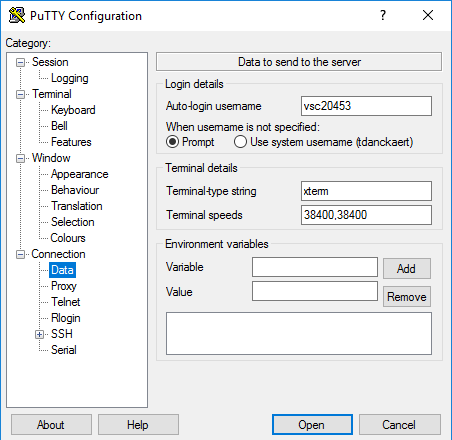
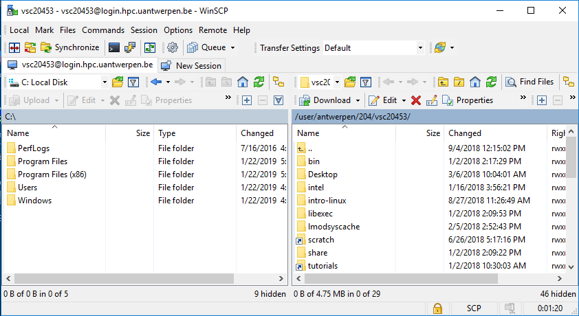



# Connecting to the HPC infrastructure

Before you can really start using the {{ hpc }} clusters, there are several things
you need to do or know:

1.  You need to **log on to the cluster** using an SSH client to one of
    the login nodes. This will give you command-line access. The
    software you'll need to use on your client system depends on its
    operating system.

2.  Before you can do some work, you'll have to **transfer the files**
    that you need from your desktop computer to the cluster. At the end
    of a job, you might want to transfer some files back.

3.  Optionally, if you wish to use programs with a **graphical user
    interface**, you will need an X-server on your client system and log
    in to the login nodes with X-forwarding enabled.

4.  Often several versions of **software packages and libraries** are
    installed, so you need to select the ones you need. To manage
    different versions efficiently, the VSC clusters use so-called
    **modules**, so you will need to select and load the modules that
    you need.

## Connection restrictions

Since March 20th 2020, restrictions are in place that limit from where
you can connect to the VSC HPC infrastructure, in response to security
incidents involving several European HPC centres.

VSC login nodes are only directly accessible from within university
networks, and from (most) Belgian commercial internet providers.

All other IP domains are blocked by default. If you are connecting from
an IP address that is not allowed direct access, you have the following
options to get access to VSC login nodes:

-   Use an VPN connection to connect to {{ university }} the network (recommended). 
     See <https://helpdesk.ugent.be/vpn/en/> for more information. 

-   Whitelist your IP address automatically by accessing
    <https://firewall.vscentrum.be> and log in with your {{ university }} account.

    -   While this web connection is active new SSH sessions can be
        started.

    -   Active SSH sessions will remain active even when this web page
        is closed.

-   Contact your HPC support team (via {{ hpcinfo }}) and ask them to whitelist your
    IP range (e.g., for industry access, automated processes).

Trying to establish an SSH connection from an IP address that does not
adhere to these restrictions will result in an immediate failure to
connect, with an error message like:

<pre><code>ssh_exchange_identification: read: Connection reset by peer
</code></pre>

## First Time connection to the HPC infrastructure

If you have any issues connecting to the {{ hpc }} after you've followed these
steps, see [Issues connecting to login node](../troubleshooting/#issues-connecting-to-login-node) to troubleshoot.


When connecting from outside Belgium, you need a VPN client to connect
to the network first.



### Open a Terminal

You've generated a public/private key pair with PuTTYgen and have an
approved account on the VSC clusters. The next step is to setup the
connection to (one of) the {{ hpc }}.

In the screenshots, we show the setup for user 

"***vsc20167***"


"***vsc20167***"


"***vsc20167***"


"***vsc30468***"

to the {{ hpc }} cluster via the login node "***{{ loginnode }}***".


1.  Start the PuTTY executable `putty.exe` in your directory
    `C:\Program Files (x86)\PuTTY` and the configuration screen will pop
    up. As you will often use the PuTTY tool, we recommend adding a
    shortcut on your desktop.

2.  Within the category <***Session***\>, in the field <***Host Name***\>, enter the name of the
    login node of the cluster (i.e., "***{{ loginnode }}***") you want to connect to.

    
    { style="display: block; margin: 0 auto" }
    

    
    { style="display: block; margin: 0 auto" }
    

3.  In the category ++"Connection > Data"++, in the field ++"Auto-login username"++, put in <*{{ userid }}*\> , which is your VSC
    username that you have received by e-mail after your request was
    approved.

    
    { style="display: block; margin: 0 auto" }
    

    
    { style="display: block; margin: 0 auto" }
    

4.  In the category ++"Connection > SSH > Auth"++, in the field ++"Private key file for authentication"++ click on ++"Browse"++ and select the private key
    (i.e., "id_rsa.ppk") that you generated and saved above.

    { style="display: block; margin: 0 auto" }

5.  In the category ++"Connection > SSH > X11"++, click the ++"Enable X11 Forwarding"++ checkbox.

    { style="display: block; margin: 0 auto" }

6.  Now go back to <Session\>, and fill in "**{{ hpcname }}**" in the ++"Saved Sessions"++ field and press ++"Save"++ to
    store the session information.

    
    { style="display: block; margin: 0 auto" }
    

    
    { style="display: block; margin: 0 auto" }
    

7.  Now pressing ++"Open"++, will open a terminal window and asks for you
    passphrase.
    
    { style="display: block; margin: 0 auto" }
    

    
    { style="display: block; margin: 0 auto" }
    

8.  If this is your first time connecting, you will be asked to verify
    the authenticity of the login node. Please see
    section [Warning message when first connecting to new host](../troubleshooting/#warning-message-when-first-connecting-to-new-host)
    on how to do this.

9.  After entering your correct passphrase, you will be connected to the
    login-node of the {{ hpc }}.

10. To check you can now "Print the Working Directory" (pwd) and check
    the name of the computer, where you have logged in (hostname):

    <pre><code>    <b>$ pwd</b>
    {{ homedir }}
    <b>$ hostname -f</b>
    {{ loginhost }}
    </code></pre>

11. For future PuTTY sessions, just select your saved session (i.e. "**{{ hpcname }}**")
    from the list, ++"Load"++ it and press ++"Open"++.



### Connect

Open up a terminal and enter the following command to connect to the {{ hpc }}.


You can open a terminal by navigation to Applications and then Utilities in the finder and open Terminal.app, or enter Terminal in Spotlight Search.


<pre><code><b>$ ssh {{ userid }}@{{ loginnode }}</b>
</code></pre>

Here, user {{ userid }} wants to make a connection to the "{{ hpcname }}" cluster at {{ university }} via the login
node "{{ loginnode }}", so replace {{ userid }} with your own VSC id in the above command.

The first time you make a connection to the login node, you will be
asked to verify the authenticity of the login node. Please check
[Warning message when first connecting to new host](../troubleshooting/#warning-message-when)-first-connecting-to-new-host) on how to do this.

A possible error message you can get if you previously saved your
private key somewhere else than the default location
(`$HOME/.ssh/id_rsa`):

<pre><code>Permission denied (publickey,gssapi-keyex,gssapi-with-mic).
</code></pre>

In this case, use the `-i` option for the `ssh` command to specify the
location of your private key. For example:

<pre><code><b>$ ssh -i /home/example/my_keys</b>
</code></pre>



**Congratulations, you're on the {{ hpc }} infrastructure now!**
To find out where you have landed you can print the current working directory:

<pre><code><b>$ pwd</b>
{{ homedir }}
</code></pre>

Your new private home directory is "{{ homedir }}". Here you can create your own
subdirectory structure, copy and prepare your applications, compile and
test them and submit your jobs on the {{ hpc }}.

<pre><code><b>$ cd {{ tutorialdir }}</b>
<b>$ ls</b>
Intro-HPC/
</code></pre>

This directory currently contains all training material for the ***Introduction to the {{ hpc }}***. More
relevant training material to work with the {{ hpc }} can always be added later in
this directory.

You can now explore the content of this directory with the "ls --l" (**l**ist**s** **l**ong) and the "cd" (**c**hange irectory) commands:

As we are interested in the use of the ***HPC***, move further to ***Intro-HPC*** and explore the
contents up to 2 levels deep:

<pre><code><b>$ cd Intro-HPC</b>
<b>$ tree -L 2</b>
.
'-- examples 
    |-- Compiling-and-testing-your-software-on-the-HPC 
    |-- Fine-tuning-Job-Specifications 
    |-- Multi-core-jobs-Parallel-Computing
    |-- Multi-job-submission 
    |-- Program-examples 
    |-- Running-batch-jobs
    |-- Running-jobs-with-input 
    |-- Running-jobs-with-input-output-data
    |-- example.pbs 
    '-- example.sh 
9 directories, 5 files
</code></pre>

This directory contains:

1.  This ***HPC Tutorial*** (in either a Mac, Linux or      Windows version).

2.  An ***examples*** subdirectory, containing all the examples that you need in this
    Tutorial, as well as examples that might be useful for your specific applications.

<pre><code><b>$ cd examples</b>
</code></pre>

!!! tip
    Typing `cd ex` followed by ++tab++ (the Tab-key) will generate the `cd examples`
    command. **Command-line completion** (also tab completion) is a common feature of the bash command
    line interpreter, in which the program automatically fills in partially
    typed commands.

!!! tip
    For more exhaustive tutorials about Linux usage, see Appendix [Useful Linux Commands](../useful_linux_commands)


The first action is to copy the contents of the {{ hpc }} examples directory to
your home directory, so that you have your own personal copy and that
you can start using the examples. The "-r" option of the copy command
will also copy the contents of the sub-directories "*recursively*".

<pre><code><b>$ cp -r {{ examplesdir }} ~/</b>
</code></pre>



Go to your home directory, check your own private examples directory, ... and start working.

<pre><code><b>$ cd</b>
<b>$ ls -l</b>
</code></pre>

Upon connecting you will see a login message containing your last login time stamp and a basic overview of the current cluster utilisation.

<pre><code>Last login: Thu Mar 18 13:15:09 2021 from gligarha02.gastly.os

STEVIN HPC-UGent infrastructure status on Thu, 18 Mar 2021 13:30:01

   cluster - full - free -  part - total - running - queued
             nodes  nodes   free   nodes    jobs      jobs
-------------------------------------------------------------------
    swalot     9      0    104     126     N/A       N/A
    skitty    53      0     16      72     N/A       N/A
   victini    40      0     54      96     N/A       N/A
    joltik     8      0      2      10     N/A       N/A
     doduo   115      0     13     128     N/A       N/A
  accelgor     8      1      0       9     N/A       N/A

For a full view of the current loads and queues see:
https://hpc.ugent.be/clusterstate/ 
Updates on current system status and planned maintenance can be found on https://www.ugent.be/hpc/en/infrastructure/status
</code></pre>



Upon connecting you will see a login message containing your last login time stamp, some useful environment variable definitions and the message
of the day (MOTD).

<pre><code>Last login: Thu Nov  6 16:05:21 2014 from example.vub.ac.be

Initialising your working environment...
System variables to use in your scripts/programs:
  Temporary directory:   \$TMPDIR as /tmp/vsc40485
  Temporary work directory:    \$WORKDIR as /work/vsc40485
  Home directory:              \$HOME as /user/home/gent/vsc404/vsc40485
Message of the day:

  --------------------------------------------------------------------
  Welcome to the Hydra cluster.

  The old work directory access has been closed.


  The Hydra Team
  --------------------------------------------------------------------
       \   ,__,
        \  (oo)____
           (__)    )\
              ||--||
</code></pre>




Upon connecting you will see a login message containing your last login time stamp and some useful links.

<pre><code>Last login: Mon Jan 12 18:52:20 2015 from example.kuleuven.be
**********************************************
*                                            *
* Please check the following site for        *
* status messages concerning KU Leuven       *
* services (incl. HPC):                      *
*                                            *
*   http://status.kuleuven.be/               *
*                                            *
* For VSC user documentation:                *
*                                            *
*  https://www.vscentrum.be/en/user-portal   *
*                                            *
*                                            *
**********************************************
</code></pre>



Upon connection, you will get a welcome message containing your last login timestamp and some pointers to information about the system. On Leibniz, the system will also show your disk quota.

<pre><code>Last login: Mon Feb  2 17:58:13 2015 from mylaptop.uantwerpen.be

---------------------------------------------------------------

Welcome to LEIBNIZ !

Useful links:
  https://vscdocumentation.readthedocs.io
  https://vscdocumentation.readthedocs.io/en/latest/antwerp/tier2_hardware.html
  https://www.uantwerpen.be/hpc

Questions or problems? Do not hesitate and contact us:
  hpc@uantwerpen.be

Happy computing!

---------------------------------------------------------------

Your quota is:

                   Block Limits
   Filesystem       used      quota      limit    grace
   user             740M         3G       3.3G     none
   data           3.153G        25G      27.5G     none
   scratch        12.38M        25G      27.5G     none
   small          20.09M        25G      27.5G     none

                   File Limits
   Filesystem      files      quota      limit    grace
   user            14471      20000      25000     none
   data             5183     100000     150000     none
   scratch            59     100000     150000     none
   small            1389     100000     110000     none

---------------------------------------------------------------
</code></pre>


You can exit the connection at anytime by entering:

<pre><code>$ exit
logout
Connection to {{ loginnode }} closed.
</code></pre>

!!! tip "tip: Setting your Language right"
    You may encounter a warning message similar to the following one during connecting:

    ```
    perl: warning: Setting locale failed.
    perl: warning: Please check that your locale settings:
    LANGUAGE = (unset),
    LC_ALL = (unset),
    LC_CTYPE = "UTF-8",
    LANG = (unset)
        are supported and installed on your system.
    perl: warning: Falling back to the standard locale ("C").
    ```
    or any other error message complaining about the locale.

    This means that the correct "locale" has not yet been properly specified on your local machine. Try:
    ```
    LANG=
    LC_COLLATE="C"
    LC_CTYPE="UTF-8"
    LC_MESSAGES="C"
    LC_MONETARY="C"
    LC_NUMERIC="C"
    LC_TIME="C"
    LC_ALL=
    ```

A **locale** is a set of parameters that defines the user's language, country and
any special variant preferences that the user wants to see in their user
interface. Usually a locale identifier consists of at least a language
identifier and a region identifier.


!!! Note
    If you try to set a non-supported locale, then it will be automatically
    set to the default. Currently the default is `en_US.UFT-8` or `en_US`,
    depending on whether your originally (non-supported) locale was `UTF-8` or not.



Open the `.bashrc` on your local machine with your favourite editor and
add the following lines:
    
<pre><code><b>$ nano ~/.bashrc</b>
...
export LANGUAGE="en_US.UTF-8"
export LC_ALL="en_US.UTF-8"
export LC_CTYPE="en_US.UTF-8"
export LANG="en_US.UTF-8"
...
</code></pre>

!!! tip "tip: vi"
    To start entering text in vi: move to the place you want to start
    entering text with the arrow keys and type "i" to switch to insert mode. You can easily exit vi by entering: "++"ESC"++ :wq" 
    To exit vi without saving your changes, enter "++"ESC"++:q!"


or alternatively (if you are not comfortable with the Linux editors),
again on your local machine:

<pre><code><b>$ echo "export LANGUAGE=\"en_US.UTF-8\"" >> ~/.profile</b>
<b>$ echo "export LC_ALL=\"en_US.UTF-8\"" >> ~/.profile</b>
<b>$ echo "export LC_CTYPE=\"en_US.UTF-8\"" >> ~/.profile</b>
<b>$ echo "export LANG=\"en_US.UTF-8\"" >> ~/.profile</b>
</code></pre>

You can now log out, open a new terminal/shell on your local machine and
reconnect to the , and you should not get these warnings anymore.


## Transfer Files to/from the HPC

Before you can do some work, you'll have to **transfer the files** you need from your desktop or department to the cluster. At the end of a job, you might want to transfer some files back.


The preferred way to transfer files is by using an scp or sftp via the
secure OpenSSH protocol. {{ OS }} ships with an implementation of OpenSSH, so you
don't need to install any third-party software to use it. Just open a
terminal window and jump in!




### WinSCP

To transfer files to and from the cluster, we recommend the use of
WinSCP, a graphical file management tool which can transfer files using
secure protocols such as SFTP and SCP. WinSCP is freely available from
<http://www.winscp.net>.

To transfer your files using WinSCP,

1.  Open the program

2.  The ++"Login"++ menu is shown automatically (if it is closed, click ++"New Session"++ to open it again). Fill in the necessary fields under ++"Session"++

    1.  Click ++"New Site"++.

    2.  Enter "*{{ loginnode }}*" in the ++"Host name"++ field.

    3.  Enter your "*vsc-account*" in the ++"User name"++ field.

    4.  Select ++"SCP"++ as the ++"file"++ protocol.

    5.  Note that the password field remains empty.

    
    { style="display: block; margin: 0 auto" }
    
    
    { style="display: block; margin: 0 auto" }
    
    
    { style="display: block; margin: 0 auto" }
    
    
    { style="display: block; margin: 0 auto" }
    

    { style="display: block; margin: 0 auto" }

    6.  Click ++"Advanced..."++.

    7.  Click ++"SSH > Authentication"++.

    8.  Select your private key in the field ++"Private key file"++.

3.  Press the ++"Save"++ button, to save the session under ++"Session > Sites"++ for future access.

4.  Finally, when clicking on ++"Login"++, you will be asked for your key passphrase.

    
    { style="display: block; margin: 0 auto" }
    
    
    { style="display: block; margin: 0 auto" }
    
    
    { style="display: block; margin: 0 auto" }
    
    
    { style="display: block; margin: 0 auto" }
    






{ style="display: block; margin: 0 auto" }


{ style="display: block; margin: 0 auto" }


{ style="display: block; margin: 0 auto" }


{ style="display: block; margin: 0 auto" }


Now, try out whether you can transfer an arbitrary file from your local
machine to the HPC and back.




### Using scp

**Secure copy** or **SCP** is a tool (command) for securely transferring files between a local
host (= your computer) and a remote host (the {{ hpc }}). It is based on the
Secure Shell (SSH) protocol. The **scp** command is the equivalent of the **cp** (i.e.,
**c**o**p**y) command, but can copy files to or from remote machines.

It's easier to copy files directly to `$VSC_DATA` and `$VSC_SCRATCH` if
you have symlinks to them in your home directory. See{{ LinuxManualURL.LinuxManualURL(OS, site) }} for how to do this.

Open an additional terminal window and check that you're working on your
local machine.

<pre><code><b>$ hostname</b>
<local-machine-name>
</code></pre>

If you're still using the terminal that is connected to the {{ hpc }}, close the
connection by typing "exit" in the terminal window.

For example, we will copy the (local) file "*localfile.txt*" to your
home directory on the {{ hpc }} cluster. We first generate a small dummy
"*localfile.txt*", which contains the word "Hello". Use your own VSC
account, which is something like "{{ userid }}". Don't forget the colon (`:`) at the
end: if you forget it, it will just create a file named {{ userid }}@{{ loginnode }} on your
local filesystem. You can even specify where to save the file on the
remote filesystem by putting a path after the colon.

<pre><code><b>$ echo "Hello" > localfile.txt</b>
<b>$ ls -l </b>
...
-rw-r--r-- 1 user  staff   6 Sep 18 09:37 localfile.txt
$ scp localfile.txt {{ userid }}@{{ loginnode }}
localfile.txt     100%   6     0.0KB/s     00:00
</code></pre>

Connect to the {{ hpc }} via another terminal, print the working directory (to
make sure you're in the home directory) and check whether the file has
arrived:

<pre><code><b>$ pwd</b>
{{ homedir }}
<b>$ ls -l </b>
total 1536 
drwxrwxr-x 2 
drwxrwxr-x 2 
drwxrwxr-x 10 
-rw-r--r-- 1 
<b>$ cat localfile.txt</b>
Hello
</code></pre>

The **scp** command can also be used to copy files from the cluster to your
local machine. Let us copy the remote file "intro-HPC-{{ OS }}-{{ site }}.pdf" from your "docs" 
subdirectory on the cluster to your local computer.

First, we will confirm that the file is indeed in the "docs"
subdirectory. On the terminal on the , enter:

<pre><code><b>$ cd ~/docs</b>
<b>$ ls -l</b>
total 1536 
-rw-r--r-- 1 {{ userid }} Sep 11 09:53 intro-HPC-{{ OS }}-{{ site }}.pdf
</code></pre>

Now we will copy the file to the local machine. On the terminal on your
own local computer, enter:

<pre><code><b>$ scp {{ userid }}@{{ loginnode }}:./docs/intro-HPC-{{ OS }}-{{ site }}.pdf .</b>
intro-HPC-{{ OS }}-{{ site }}.pdf 100% 725KB 724.6KB/s 00:01
<b>$ ls -l</b>
total 899 
-rw-r--r-- 1 user staff 741995 Sep 18 09:53 
-rw-r--r-- 1 user staff      6 Sep 18 09:37 localfile.txt
</code></pre>

The file has been copied from the HPC to your local computer.

It's also possible to copy entire directories (and their contents) with
the `-r` flag. For example, if we want to copy the local directory
`dataset` to `$VSC_SCRATCH`, we can use the following command (assuming
you've created the `scratch` symlink):

<pre><code><b>$ scp -r dataset {{ userid }}@{{ loginnode }}:scratch</b>
</code></pre>

If you don't use the `-r` option to copy a directory, you will run into
the following error:

<pre><code><b>$ scp -r dataset {{ userid }}@{{ loginnode }}:scratch</b>
dataset: not a regular file
</code></pre>

### Using sftp

The **SSH File Transfer Protocol** (also **Secure File Transfer Protocol**, or **SFTP**) is a network protocol that provides file access, file
transfer and file management functionalities over any reliable data
stream. It was designed as an extension of the Secure Shell protocol
(SSH) version 2.0. This protocol assumes that it is run over a secure
channel, such as SSH, that the server has already authenticated the
client, and that the identity of the client user is available to the
protocol.

The sftp is an equivalent of the ftp command, with the difference that
it uses the secure ssh protocol to connect to the clusters.

One easy way of starting a sftp session is

<pre><code><b>$ sftp {{ userid }}@{{ loginnode }}</b>
</code></pre>

Typical and popular commands inside an sftp session are:


| []()                      |                                                                                      |
|:--------------------------|:-------------------------------------------------------------------------------------|
| **cd ~/exmples/fibo**     | Move to the examples/fibo subdirectory on the (i.e., the {{ hpc }} remote machine)   |
| **ls**                    | Get a list of the files in the current directory on the {{ hpc }}.                   |
| **get fibo.py**           | Copy the file "fibo.py" from the {{ hpc }}                                           |
| **get tutorial/HPC.pdf**  | Copy the file "HPC.pdf" from the {{ hpc }}, which is in the "tutorial" subdirectory. |
| **lcd test**              | Move to the "test" subdirectory on your local machine.                               |
| **lcd ..**                | Move up one level in the local directory.                                            |
| **lls**                   | Get local directory listing.                                                         |
| **put test.py**           | Copy the local file test.py to the {{ hpc }}.                                        |
| **put test1.py test2.py** | Copy the local file test1.py to the and rename it to test2.py.                       |
| **bye**                   | Quit the sftp session                                                                |
| **mget *.cc**             | Copy all the remote files with extension ".cc" to the local directory.               |
| **mput *.h**              | Copy all the local files with extension ".h" to the {{ hpc }}.                       |
| []()                      |                                                                                      |





### Using a GUI

If you prefer a GUI to transfer files back and forth to the {{ hpc }}, you can
use your file browser. Open your file browser and press


++"Ctrl"+"l"++



++cmd+"k"++


This should open up a address bar where you can enter a URL.
Alternatively, look for the "connect to server" option in your file
browsers menu.

Enter: *sftp://{{ userid }}@{{ loginnode}}/* and press enter.

You should now be able to browse files on the {{ hpc }} in your file browser.



### Using a GUI (Cyberduck)

Cyberduck is a graphical alternative to the `scp` command. It can be
installed from <https://cyberduck.io>.

This is the one-time setup you will need to do before connecting:

1.  After starting Cyberduck, the Bookmark tab will show up. To add a
    new bookmark, click on the "+" sign on the bottom left of the
    window. A new window will open.

2.  In the drop-down menu on top, select "SFTP (SSH File Transfer Protocol)".

3.  In the "Server" field, type in `{{ loginnode }}`. In the "Username" field, type in
    your VSC account id (this looks like `{{ userid }}`).

4.  Select the location of your SSH *private* key in the "SSH Private Key" field.

5.  Finally, type in a name for the bookmark in the "Nickname" field and
    close the window by pressing on the red circle in the top left
    corner of the window.

To open the connection, click on the "Bookmarks" icon (which
resembles an open book) and double-click on the bookmark you just
created.


### Fast file transfer for large datasets

See [the section on `rsync` in chapter 5 of the Linux intro manual](../linux-tutorial/uploading_files/#copying-faster-with-rsync).

## Changing login nodes
It can be useful to have control over which login node you are on. However, when you connect to the HPC (High-Performance Computing) system, you are directed to a random login node, which might not be the one where you already have an active session. To address this, there is a way to manually switch your active login node.

For instance, if you want to switch to the login node named `{{loginhost}}`, you can use the following command while you are connected to the `{{altloginhost}}` login node on the HPC:
```shell
ssh {{loginhost}}
```
This is also possible the other way around.

If you want to find out which login host you are connected to, you can use the `hostname` command.
<pre><code>$ <b>hostname</b> 
{{loginhost}}
$ <b>ssh {{altloginhost}}</b>

$ <b>hostname</b> 
{{altloginhost}}
</code></pre>


Rather than always starting a new session on the HPC, you can also use a terminal multiplexer like `screen` or `tmux`.
These can make sessions that 'survives' across disconnects.
You can find more information on how to use these tools here (or on other online sources):

- [screen](https://www.howtogeek.com/662422/how-to-use-linuxs-screen-command/)
- [tmux](https://www.howtogeek.com/671422/how-to-use-tmux-on-linux-and-why-its-better-than-screen/)
