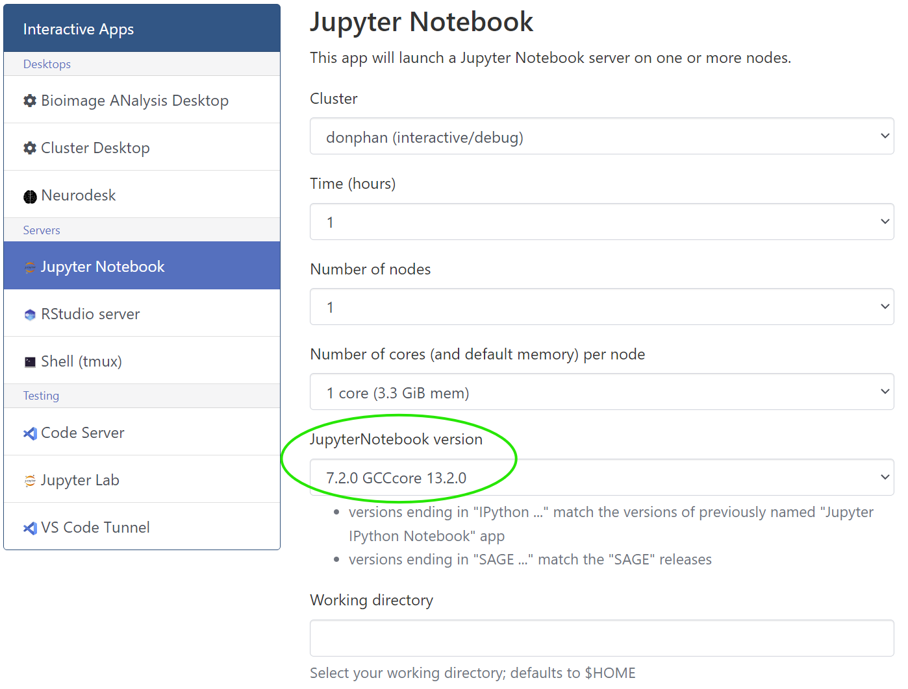
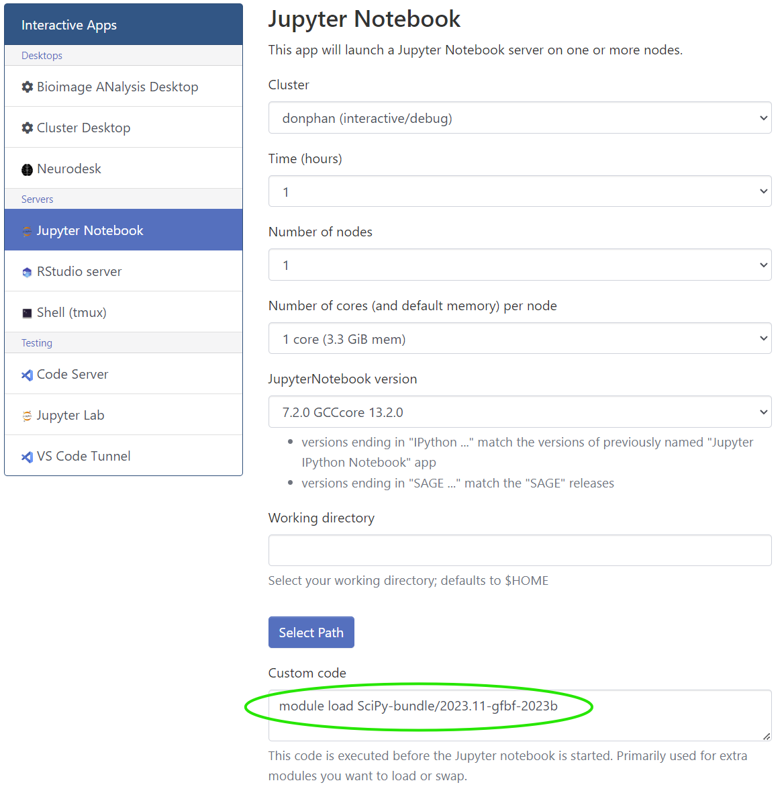

# Jupyter notebook

## What is a Jupyter notebook

A [Jupyter notebook](https://jupyter.org/) is an interactive, web-based environment that allows you to create documents that contain live code, equations, visualizations, and plaintext. The code blocks in these documents can be used to write Python, Java, R and Julia code, among others. The combination of code executions with text and visual outputs make it a useful tool for data analysis, machine learning and educational purposes.

## Using Jupyter Notebooks on the HPC

### Launching a notebook using the web portal

Through the [HPC-UGent web portal](web_portal.md) you can easily start a Jupyter notebook on a workernode, via the *Jupyter Notebook* button under the *Interactive Apps* menu item.


After starting the Jupyter notebook using the *Launch* button, you will see it being added in state *Queued* in the overview of interactive sessions (see *My Interactive Sessions* menu item):


When your job hosting the Jupyter notebook starts running, the status will first change the *Starting*:


and eventually the status will change to *Running*, and you will be able to connect to the Jupyter environment using the blue *Connect to Jupyter* button:


This will launch the Jupyter environment in a new browser tab, where you can open an existing notebook by navigating to the directory where it is located and clicking it. You can also create a new notebook by clicking on `File`>`New`>`Notebook`:


### Using extra Python packages

A number of Python packages are readily available in modules on the HPC. To illustrate how to use them in a Jupyter notebook, we will make use of an example where we want to use numpy in our notebook.
The first thing we need to do is finding the modules that contain our package of choice. For numpy, this would be the `SciPy-bundle` modules.

To find the appropriate modules, it is recommended to use the shell within the web portal under `Clusters`>`>_login Shell Access`.


We can see all available versions of the SciPy module by using `module avail SciPy-bundle`:

```shell 
$ module avail SciPy-bundle

------------------ /apps/gent/RHEL8/zen2-ib/modules/all ------------------
    SciPy-bundle/2022.05-foss-2022a    SciPy-bundle/2023.11-gfbf-2023b (D)
    SciPy-bundle/2023.07-gfbf-2023a

  Where:
   D:  Default Module
...
```

Not all modules will work for every notebook, we need to use the one that uses the same toolchain as the notebook we want to launch. To find that toolchain, we can look at the `JupyterNotebook version` field when creating a notebook. In our example `7.2.0` is the version of the notebook and `GCCcore/13.2.0` is the toolchain used.





Module names include the toolchain that was used to install the module (for example `gfbf-2023b` in `SciPy-bundle/2023.11-gfbf-2023b` means that that module uses the toolchain `gfbf/2023`). To see which modules are compatible with each other, you can check the table on the [page about Module conflicts](troubleshooting.md#module-conflicts). Another way to find out which `GCCcore` subtoolchain goes with the particular toolchain of the module (such as `gfbf/2023b`) is to use `module show`. In particular using `module show <toolchain of the module> | grep GCC` (before the module has been loaded) will return this `GCCcore` version.

```shell
$ module show gfbf/2023b | grep GCC
GNU Compiler Collection (GCC) based compiler toolchain, including
whatis("Description: GNU Compiler Collection (GCC) based compiler toolchain, including
load("GCC/13.2.0")
load("FlexiBLAS/3.3.1-GCC-13.2.0")
load("FFTW/3.3.10-GCC-13.2.0")
```

The toolchain used can then for example be found within the line `load("GCC/13.2.0")` and the included Python packages under the line `Included extensions`.

It is also recommended to doublecheck the compatibility of the Jupyter notebook version and the extra modules by loading them all in a shell environment. 
To do so, find the module containing the correct Jupyter notebook version (for our example case this is `JupyterNotebook/7.2.0-GCCcore-13.2.0`) and then use `module load <module_name>` for every module as follows:

```shell
$ module load JupyterNotebook/7.2.0-GCCcore-13.2.0
$ module load SciPy-bundle/2023.11-gfbf-2023b
```
This throws no errors, since this module uses a toolchain that is compatible with the toolchain used by the notebook

If we use a different SciPy module that uses an incompatible toolchain, 
we will get a module load conflict when trying to load it 
(for more info on these errors, consult the [troubleshooting page](troubleshooting.md#module-conflicts)).

```shell
$ module load JupyterNotebook/7.2.0-GCCcore-13.2.0
$ module load SciPy-bundle/2023.07-gfbf-2023a
Lmod has detected the following error:  ...
```

Now that we found the right module for the notebook, add `module load <module_name>` in the `Custom code` field when creating a notebook and you can make use of the packages within that notebook.



