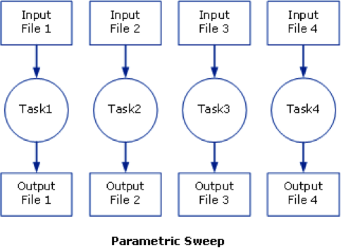

# Multi-job submission

A frequent occurring characteristic of scientific computation is their
focus on data intensive processing. A typical example is the iterative
evaluation of a program over different input parameter values, often
referred to as a "*parameter sweep*". A **Parameter Sweep** runs a job a specified number of
times, as if we sweep the parameter values through a user defined range.

Users then often want to submit a large numbers of jobs based on the
same job script but with (i) slightly different parameters settings or
with (ii) different input files.

These parameter values can have many forms, we can think about a range
(e.g., from 1 to 100), or the parameters can be stored line by line in a
comma-separated file. The users want to run their job once for each
instance of the parameter values.

One option could be to launch a lot of separate individual small jobs
(one for each parameter) on the cluster, but this is not a good idea.
The cluster scheduler isn't meant to deal with tons of small jobs. Those
huge amounts of small jobs will create a lot of overhead, and can slow
down the whole cluster. It would be better to bundle those jobs in
larger sets. In TORQUE, an experimental feature known as "*job arrays*"
existed to allow the creation of multiple jobs with one *qsub* command,
but is was not supported by Moab, the current scheduler.

The "**Worker framework**" has been developed to address this issue.

It can handle many small jobs determined by:

**parameter variations**

:   i.e., many small jobs determined by a specific parameter set which
    is stored in a .csv (comma separated value) input file.

**job arrays**

:   i.e., each individual job got a unique numeric identifier.

Both use cases often have a common root: the user wants to run a program
with a large number of parameter settings, and the program does not
allow for aggregation, i.e., it has to be run once for each instance of
the parameter values.

However, the Worker Framework's scope is wider: it can be used for any
scenario that can be reduced to a **MapReduce** approach.[^1]

## The worker Framework: Parameter Sweeps

First go to the right directory:
<pre><code>$ <b>cd ~/examples/Multi-job-submission/par_sweep</b></code></pre>

Suppose the program the user wishes to run the "*weather*" program,
which takes three parameters: a temperature, a pressure and a volume. A
typical call of the program looks like:
<pre><code>$ <b>./weather -t 20 -p 1.05 -v 4.3</b>
T: 20  P: 1.05  V: 4.3</code></pre>

For the purpose of this exercise, the weather program is just a simple
bash script, which prints the 3 variables to the standard output and
waits a bit:

<p style="text-align: center">par_sweep/weather</p>

```shell

```

A job script that would run this as a job for the first parameters (p01)
would then look like:

<p style="text-align: center">par_sweep/weather_p01.pbs</p>

```shell

```

When submitting this job, the calculation is performed or this
particular instance of the parameters, i.e., temperature = 20, pressure
= 1.05, and volume = 4.3.

To submit the job, the user would use:
<pre><code>$ <b>qsub weather_p01.pbs</b></code></pre>
However, the user wants to run this program for many parameter
instances, e.g., he wants to run the program on 100 instances of
temperature, pressure and volume. The 100 parameter instances can be
stored in a comma separated value file (.csv) that can be generated
using a spreadsheet program such as Microsoft Excel or RDBMS or just by
hand using any text editor (do **not** use a word processor such as Microsoft
Word). The first few lines of the file "*data.csv*" would look like:
<pre><code>$ <b>more data.csv</b>
temperature, pressure, volume
293, 1.0e5, 107
294, 1.0e5, 106
295, 1.0e5, 105
296, 1.0e5, 104
297, 1.0e5, 103
...</code></pre>

It has to contain the names of the variables on the first line, followed
by 100 parameter instances in the current example.

In order to make our PBS generic, the PBS file can be modified as
follows:

<p style="text-align: center">par_sweep/weather.pbs</p>

```shell

```

Note that:

1.  the parameter values 20, 1.05, 4.3 have been replaced by variables
    $temperature, $pressure and $volume respectively, which were
    being specified on the first line of the "*data.csv*" file;

2.  the number of processors per node has been increased to 8 (i.e.,
    ppn=1 is replaced by ppn=8);

3.  the walltime has been increased to 4 hours (i.e., walltime=00:15:00
    is replaced by walltime=04:00:00).

The walltime is calculated as follows: one calculation takes 15 minutes,
so 100 calculations take 1500 minutes on one CPU. However, this job will
use 8 CPUs, so the 100 calculations will be done in 1500/8 = 187.5
minutes, i.e., 4 hours to be on the safe side.

The job can now be submitted as follows (to check which `worker` module
to use, see subsection [Using explicit version numbers](running_batch_jobs.md#using-explicit-version-numbers)):
<pre><code>$ <b>module load worker/1.6.12-foss-2021b</b>
$ <b>wsub -batch weather.pbs -data data.csv</b>
total number of work items: 41
{{jobid}}</code></pre>

Note that the PBS file is the value of the -batch option. The weather
program will now be run for all 100 parameter instances -- 8
concurrently -- until all computations are done. A computation for such
a parameter instance is called a work item in Worker parlance.

!!! warning
    When you attempt to submit a worker job on a non-default cluster, you might encounter an `Illegal instruction` error. In such cases, the solution is to use a different `module swap` command. For example, to submit a worker job to the [`donphan` debug cluster](interactive_debug.md) from the login nodes, use:
    <pre><code>$ <b>module swap env/slurm/donphan</b>
    </code></pre>
    instead of
    <pre><code>$ <b>module swap cluster/donphan </b></code></pre>
    We recommend using a `module swap cluster` command after submitting the jobs. Additional information about this as well as more comprehensive details concerning the 'Illegal instruction' error can be accessed [here](troubleshooting.md#multi-job-submissions-on-a-non-default-cluster).

## The Worker framework: Job arrays
[//]: # (sec:worker-framework-job-arrays)

First go to the right directory:
<pre><code>$ <b>cd ~/examples/Multi-job-submission/job_array</b></code></pre>

As a simple example, assume you have a serial program called *myprog*
that you want to run on various input files *input\[1-100\]*.

{ style="display: block; margin: 0 auto; width: 3.22in; height: 2.36in"}

The following bash script would submit these jobs all one by one:
```shell
#!/bin/bash
for i in `seq 1 100`; do
  qsub -o output $i -i input $i myprog.pbs
done
```

This, as said before, could be disturbing for the job scheduler.

Alternatively, TORQUE provides a feature known as *job arrays* which
allows the creation of multiple, similar jobs with only **one qsub** command. This
feature introduced a new job naming convention that allows users either
to reference the entire set of jobs as a unit or to reference one
particular job from the set.

Under TORQUE, the *-t range* option is used with qsub to specify a job
array, where *range* is a range of numbers (e.g., *1-100* or *2,4-5,7*).

The details are

1.  a job is submitted for each *number* in the range;

2.  individuals jobs are referenced as *jobid-number*, and the entire
    array can be referenced as *jobid* for easy killing etc.; and

3.  each job has *PBS_ARRAYID* set to its *number* which allows the
    script/program to specialise for that job

The job could have been submitted using:
<pre><code>$ <b>qsub -t 1-100 my_prog.pbs</b></code></pre>

The effect was that rather than 1 job, the user would actually submit
100 jobs to the queue system. This was a popular feature of TORQUE, but
as this technique puts quite a burden on the scheduler, it is not
supported by Moab (the current job scheduler).

To support those users who used the feature and since it offers a
convenient workflow, the "worker framework" implements the idea of "job
arrays" in its own way.

A typical job script for use with job arrays would look like this:

<p style="text-align: center">job_array/job_array.pbs</p>

```shell 

```

In our specific example, we have prefabricated 100 input files in the
"./input" subdirectory. Each of those files contains a number of
parameters for the "test_set" program, which will perform some tests
with those parameters.

Input for the program is stored in files with names such as input_1.dat,
input_2.dat, ..., input_100.dat in the ./input subdirectory.
<pre><code>$ <b>ls ./input</b>
...
$ <b>more ./input/input_99.dat</b>
This is input file \#99
Parameter #1 = 99
Parameter #2 = 25.67
Parameter #3 = Batch
Parameter #4 = 0x562867</code></pre>

For the sole purpose of this exercise, we have provided a short
"test_set" program, which reads the "input" files and just copies them
into a corresponding output file. We even add a few lines to each output
file. The corresponding output computed by our "*test_set*" program will
be written to the *"./output*" directory in output_1.dat, output_2.dat,
..., output_100.dat. files.

<p style="text-align: center">job_array/test_set</p>

```shell

```

Using the "worker framework", a feature akin to job arrays can be used
with minimal modifications to the job script:

<p style="text-align: center">job_array/test_set.pbs</p>

```shell

```

Note that

1.  the number of CPUs is increased to 8 (ppn=1 is replaced by ppn=8);
    and

2.  the walltime has been modified (walltime=00:15:00 is replaced by
    walltime=04:00:00).

The job is now submitted as follows:
<pre><code>$ <b>module load worker/1.6.12-foss-2021b</b>
$ <b>wsub -t 1-100 -batch test_set.pbs</b>
total number of work items: 100
{{jobid}}</code></pre>

The "*test_set*" program will now be run for all 100 input files -- 8
concurrently -- until all computations are done. Again, a computation
for an individual input file, or, equivalently, an array id, is called a
work item in Worker speak.

Note that in contrast to TORQUE job arrays, a worker job array only
submits a single job.
<pre><code>$ <b>qstat</b>
Job id          Name          User      Time   Use S Queue
--------------- ------------- --------- ---- ----- - -----
{{jobid}}  test_set.pbs  {{userid}}          0 Q

And you can now check the generated output files:
$ <b>more ./output/output_99.dat</b>
This is output file #99
Calculations done, no results
</code></pre>

## MapReduce: prologues and epilogue

Often, an embarrassingly parallel computation can be abstracted to three
simple steps:

1.  a preparation phase in which the data is split up into smaller, more
    manageable chunks;

2.  on these chunks, the same algorithm is applied independently (these
    are the work items); and

3.  the results of the computations on those chunks are aggregated into,
    e.g., a statistical description of some sort.

{style="display: block; margin: 0 auto; width: 2.40in; height: 2.78in"}

The Worker framework directly supports this scenario by using a prologue
(pre-processing) and an epilogue (post-processing). The former is
executed just once before work is started on the work items, the latter
is executed just once after the work on all work items has finished.
Technically, the master, i.e., the process that is responsible for
dispatching work and logging progress, executes the prologue and
epilogue.
<pre><code>$ <b>cd ~/examples/Multi-job-submission/map_reduce</b></code></pre>

The script "pre.sh" prepares the data by creating 100 different
input-files, and the script "post.sh" aggregates (concatenates) the
data.

First study the scripts:
<p style="text-align: center">map_reduce/pre.sh</p>

```shell

```

<p style="text-align: center">map_reduce/post.sh</p>

```shell

```


Then one can submit a MapReduce style job as follows:
<pre><code>$ <b>wsub</b> -prolog pre.sh -batch test_set.pbs -epilog post.sh -t 1-100
total number of work items: 100
{{jobid}}
$ <b>cat all_output.txt</b>
...
$ <b>rm -r -f ./output/</b></code></pre>

Note that the time taken for executing the prologue and the epilogue
should be added to the job's total walltime.

## Some more on the Worker Framework

### Using Worker efficiently

The "Worker Framework" is implemented using MPI, so it is not restricted
to a single compute nodes, it scales well to multiple nodes. However,
remember that jobs requesting a large number of nodes typically spend
quite some time in the queue.

The "Worker Framework" will be effective when

1.  work items, i.e., individual computations, are neither too short,
    nor too long (i.e., from a few minutes to a few hours); and,

2.  when the number of work items is larger than the number of CPUs
    involved in the job (e.g., more than 30 for 8 CPUs).

### Monitoring a worker job

Since a Worker job will typically run for several hours, it may be
reassuring to monitor its progress. Worker keeps a log of its activity
in the directory where the job was submitted. The log's name is derived
from the job's name and the job's ID, i.e., it has the form
`<jobname>.log<jobid>`. For the running example, this could be
`run.pbs.log{{jobid}}`, assuming the job's ID is {{jobid}}. To keep an eye on the
progress, one can use:
<pre><code>$ <b>tail -f run.pbs.log{{jobid}}</b></code></pre>

Alternatively, `wsummarize`, a Worker command that summarises a log
file, can be used:
<pre><code>$ <b>watch -n 60 wsummarize run.pbs.log{{jobid}}</b></code></pre>

This will summarise the log file every 60 seconds.

### Time limits for work items

Sometimes, the execution of a work item takes long than expected, or
worse, some work items get stuck in an infinite loop. This situation is
unfortunate, since it implies that work items that could successfully
execute are not even started. Again, the Worker framework offers a
simple and yet versatile solution. If we want to limit the execution of
each work item to at most 20 minutes, this can be accomplished by
modifying the script of the running example.
```shell
#!/bin/bash -l
#PBS -l nodes=1:ppn=8
#PBS -l walltime=04:00:00
module load timedrun/1.0
cd $PBS_O_WORKDIR
timedrun -t 00:20:00 weather -t $temperature  -p $pressure  -v $volume
```

Note that it is trivial to set individual time constraints for work
items by introducing a parameter, and including the values of the latter
in the CSV file, along with those for the temperature, pressure and
volume.

Also note that "timedrun" is in fact offered in a module of its own, so
it can be used outside the Worker framework as well.

### Resuming a Worker job

Unfortunately, it is not always easy to estimate the walltime for a job,
and consequently, sometimes the latter is underestimated. When using the
Worker framework, this implies that not all work items will have been
processed. Worker makes it very easy to resume such a job without having
to figure out which work items did complete successfully, and which
remain to be computed. Suppose the job that did not complete all its
work items had ID "445948".
<pre><code>$ <b>wresume -jobid {{jobid}}</b></code></pre>

This will submit a new job that will start to work on the work items
that were not done yet. Note that it is possible to change almost all
job parameters when resuming, specifically the requested resources such
as the number of cores and the walltime.
<pre><code>$ <b>wresume -l walltime=1:30:00 -jobid {{jobid}}}</b></code></pre>

Work items may fail to complete successfully for a variety of reasons,
e.g., a data file that is missing, a (minor) programming error, etc.
Upon resuming a job, the work items that failed are considered to be
done, so resuming a job will only execute work items that did not
terminate either successfully, or reporting a failure. It is also
possible to retry work items that failed (preferably after the glitch
why they failed was fixed).
<pre><code>$ <b>wresume -jobid {{jobid}} -retry</b></code></pre>

By default, a job's prologue is not executed when it is resumed, while
its epilogue is. "wresume" has options to modify this default behaviour.

### Further information

This how-to introduces only Worker's basic features. The wsub command
has some usage information that is printed when the -help option is
specified:
<pre><code>$ <b>wsub -help</b>
### usage: wsub  -batch &lt;batch-file&gt;          
#                [-data &lt;data-files&gt;]         
#                [-prolog &lt;prolog-file&gt;]      
#                [-epilog &lt;epilog-file&gt;]      
#                [-log &lt;log-file&gt;]            
#                [-mpiverbose]                
#                [-dryrun] [-verbose]         
#                [-quiet] [-help]             
#                [-t &lt;array-req&gt;]             
#                [&lt;pbs-qsub-options&gt;]
#
#   -batch &lt;batch-file&gt;   : batch file template, containing variables to be
#                           replaced with data from the data file(s) or the
#                           PBS array request option
#   -data &lt;data-files&gt;    : comma-separated list of data files (default CSV
#                           files) used to provide the data for the work
#                           items
#   -prolog &lt;prolog-file&gt; : prolog script to be executed before any of the
#                           work items are executed
#   -epilog &lt;epilog-file&gt; : epilog script to be executed after all the work
#                           items are executed
#   -mpiverbose           : pass verbose flag to the underlying MPI program
#   -verbose              : feedback information is written to standard error
#   -dryrun               : run without actually submitting the job, useful
#   -quiet                : don't show information
#   -help                 : print this help message
#   -t &lt;array-req&gt;        : qsub's PBS array request options, e.g., 1-10
#   &lt;pbs-qsub-options&gt;    : options passed on to the queue submission
#                           command
</code></pre>


[^1]: MapReduce: 'Map' refers to the map pattern in which every item in
    a collection is mapped onto a new value by applying a given
    function, while "reduce" refers to the reduction pattern which
    condenses or reduces a collection of previously computed results to
    a single value.
