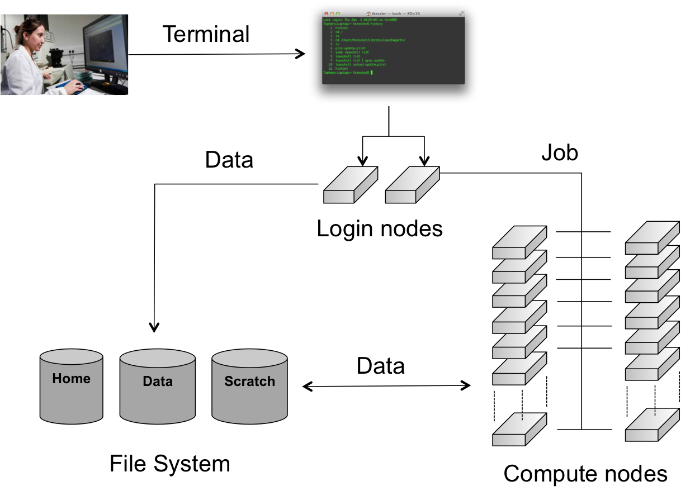

# Running batch jobs

In order to have access to the compute nodes of a cluster, you have to
use the job system. The system software that handles your batch jobs
consists of two pieces: the queue- and resource manager **TORQUE** and the
scheduler **Moab**. Together, TORQUE and Moab provide a suite of commands for
submitting jobs, altering some of the properties of waiting jobs (such
as reordering or deleting them), monitoring their progress and killing
ones that are having problems or are no longer needed. Only the most
commonly used commands are mentioned here.

{ style="display: block; margin: 0 auto" }

When you connect to the {{ hpc }}, you have access to (one of) the **login nodes** of the
cluster. There you can prepare the work you want to get done on the
cluster by, e.g., installing or compiling programs, setting up data
sets, etc. The computations however, should not be performed on this
login node. The actual work is done on the cluster's **compute nodes**. Each compute node contains a number of CPU **cores**. The compute nodes are managed by the job scheduling software (Moab) and a Resource Manager (TORQUE), which
decides when and on which compute nodes the jobs can run. It is usually
not necessary to log on to the compute nodes directly 

and is only allowed on the nodes where you have a job running 


and is only allowed on the nodes where you have a job running 

. Users can (and should) monitor
their jobs periodically as they run, but do not have to remain connected
to the {{ hpc }} the entire time.

The documentation in this "Running batch jobs" section includes a
description of the general features of job scripts, how to submit them
for execution and how to monitor their progress.

## Modules

Software installation and maintenance on a {{ hpc }} cluster such as the VSC
clusters poses a number of challenges not encountered on a workstation
or a departmental cluster. We therefore need a system on the {{ hpc }}, which is
able to easily activate or deactivate the software packages that you
require for your program execution.

### Environment Variables

The program environment on the {{ hpc }} is controlled by pre-defined settings,
which are stored in environment (or shell) variables. For more
information about environment variables, see [the chapter "Getting started", section "Variables" in the intro to Linux](../../linux-tutorial/#variables).

All the software packages that are installed on the {{ hpc }} cluster require
different settings. These packages include compilers, interpreters,
mathematical software such as MATLAB and SAS, as well as other
applications and libraries.

### The module command

In order to administer the active software and their environment
variables, the module system has been developed, which:

1.  Activates or deactivates *software packages* and their dependencies.

2.  Allows setting and unsetting of *environment variables*, including
    adding and deleting entries from list-like environment variables.

3.  Does this in a *shell-independent* fashion (necessary information is
    stored in the accompanying module file).

4.  Takes care of *versioning aspects*: For many libraries, multiple
    versions are installed and maintained. The module system also takes
    care of the versioning of software packages. For instance, it does
    not allow multiple versions to be loaded at same time.

5.  Takes care of *dependencies*: Another issue arises when one
    considers library versions and the dependencies they require. Some
    software requires an older version of a particular library to run
    correctly (or at all). Hence a variety of version numbers is
    available for important libraries. Modules typically load the
    required dependencies automatically.

This is all managed with the `module` command, which is explained in the
next sections.

There is also a shorter `ml` command that does exactly the same as the
`module` command and is easier to type. Whenever you see a `module`
command, you can replace `module` with `ml`.

### Available modules

A large number of software packages are installed on the {{ hpc }} clusters. A
list of all currently available software can be obtained by typing:

<pre><code><b>$ module available</b>
</code></pre>

It's also possible to execute `module av` or `module avail`, these are
shorter to type and will do the same thing.

This will give some output such as:


This gives a full list of software packages that can be loaded.

**The casing of module names is important**: lowercase and uppercase letters matter in module names.

### Organisation of modules in toolchains

The amount of modules on the VSC systems can be overwhelming, and it is
not always immediately clear which modules can be loaded safely together
if you need to combine multiple programs in a single job to get your
work done.

Therefore the VSC has defined so-called **toolchains**. A toolchain contains a C/C++
and Fortran compiler, a MPI library and some basic math libraries for
(dense matrix) linear algebra and FFT. Two toolchains are defined on
most VSC systems. One, the `intel` toolchain, consists of the Intel
compilers, MPI library and math libraries. The other one, the `foss`
toolchain, consists of Open Source components: the GNU compilers,
OpenMPI, OpenBLAS and the standard LAPACK and ScaLAPACK libraries for
the linear algebra operations and the FFTW library for FFT. The
toolchains are refreshed twice a year, which is reflected in their name.

E.g., `foss/{{ current_year}}a` is the first version of the `foss` toolchain in {{ current_year }}.

The toolchains are then used to compile a lot of the software installed
on the VSC clusters. You can recognise those packages easily as they all
contain the name of the toolchain after the version number in their name
(e.g., `Python/2.7.12-intel-2016b`). Only packages compiled with the
same toolchain name and version can work together without conflicts.

### Loading and unloading modules

#### module load

To "activate" a software package, you load the corresponding module file
using the `module load` command:

<pre><code><b>$ module load example</b>
</code></pre>

This will load the most recent version of *example*.

For some packages, multiple versions are installed; the load command
will automatically choose the default version (if it was set by the
system administrators) or the most recent version otherwise (i.e., the
lexicographical last after the `/`).

**However, you should specify a particular version to avoid surprises when newer versions are installed:

<pre><code><b>$ module load secondexample/2.7-intel-2016b</b>
</code></pre>

The `ml` command is a shorthand for `module load`: `ml example/1.2.3` is
equivalent to `module load example/1.2.3`.

Modules need not be loaded one by one; the two `module load` commands
can be combined as follows:

<pre><code><b>$ module load example/1.2.3 secondexample/2.7-intel-2016b</b>
</code></pre>

This will load the two modules as well as their dependencies (unless
there are conflicts between both modules).

#### module list

Obviously, you need to be able to keep track of the modules that are
currently loaded. Assuming you have run the `module load` commands
stated above, you will get the following:

<pre><code><b>$ module list</b>
Currently Loaded Modulefiles: 
1) example/1.2.3                                        6) imkl/11.3.3.210-iimpi-2016b 
2) GCCcore/5.4.0                                        7) intel/2016b 
3) icc/2016.3.210-GCC-5.4.0-2.26                        8) examplelib/1.2-intel-2016b 
4) ifort/2016.3.210-GCC-5.4.0-2.26                      9) secondexample/2.7-intel-2016b 
5) impi/5.1.3.181-iccifort-2016.3.210-GCC-5.4.0-2.26
</code></pre>

You can also just use the `ml` command without arguments to list loaded modules.

It is important to note at this point that other modules (e.g.,
`intel/2016b`) are also listed, although the user did not explicitly
load them. This is because `secondexample/2.7-intel-2016b` depends on it
(as indicated in its name), and the system administrator specified that
the `intel/2016b` module should be loaded whenever *this*
`secondexample` module is loaded. There are advantages and disadvantages
to this, so be aware of automatically loaded modules whenever things go wrong: they may have something to do with it!

#### module unload

To unload a module, one can use the `module unload` command. It works
consistently with the `load` command, and reverses the latter's effect.
However, the dependencies of the package are NOT automatically unloaded;
you will have to unload the packages one by one. When the
`secondexample` module is unloaded, only the following modules remain:

<pre><code><b>$ module unload secondexample</b>
<b>$ module list</b>
Currently Loaded Modulefiles: 
Currently Loaded Modulefiles: 
1) example/1.2.3                        5) impi/5.1.3.181-iccifort-2016.3.210-GCC-5.4.0-2.26 
2) GCCcore/5.4.0                        6) imkl/11.3.3.210-iimpi-2016b 
3) icc/2016.3.210-GCC-5.4.0-2.26        7) intel/2016b 
4) ifort/2016.3.210-GCC-5.4.0-2.26      8) examplelib/1.2-intel-2016b
</code></pre>

To unload the `secondexample` module, you can also use
`ml -secondexample`.

Notice that the version was not specified: there can only be one version
of a module loaded at a time, so unloading modules by name is not
ambiguous. However, checking the list of currently loaded modules is
always a good idea, since unloading a module that is currently not
loaded will *not* result in an error.

### Purging all modules 

In order to unload all modules at once, and hence be sure to start in a
clean state, you can use:

<pre><code><b>$ module purge</b>
</code></pre>

This is always safe: the `cluster` module (the module that specifies
which cluster jobs will get submitted to) will not be unloaded (because
it's a so-called "sticky" module). 


However, on some VSC clusters you may
be left with a very empty list of available modules after executing
`module purge`. On those systems, `module av` will show you a list of
modules containing the name of a cluster or a particular feature of a
section of the cluster, and loading the appropriate module will restore
the module list applicable to that particular system.


### Using explicit version numbers 

Once a module has been installed on the cluster, the executables or
libraries it comprises are never modified. This policy ensures that the
user's programs will run consistently, at least if the user specifies a
specific version. **Failing to specify a version may result in unexpected behaviour.**

Consider the following example: the user decides to use the `example`
module and at that point in time, just a single version 1.2.3 is
installed on the cluster. The user loads the module using:

<pre><code><b>$ module load example</b>
</code></pre>

rather than

<pre><code><b>$ module load example/1.2.3</b>
</code></pre>

Everything works fine, up to the point where a new version of `example`
is installed, 4.5.6. From then on, the user's `load` command will load
the latter version, rather than the intended one, which may lead to
unexpected problems. See for example [the following section on Module Conflicts](../troubleshooting/#module-conflicts).

Consider the following `example` modules:

<pre><code><b>$ module avail example/</b>
example/1.2.3 
example/4.5.6
</code></pre>

Let's now generate a version conflict with the `example` module, and see
what happens.


<pre><code><b>$ module av example/</b>
example/1.2.3       example/4.5.6
<b>$ module load example/1.2.3  example/4.5.6</b>
Lmod has detected the following error: A different version of the 'example' module is already loaded (see output of 'ml').
<b>$ module swap example/4.5.6</b>
</code></pre>

<!-- ::: prompt
example/1.2.3 example/4.5.6 example/4.5.6(12):ERROR:150: Module
'example/4.5.6' conflicts with the currently loaded module(s)
'example/1.2.3' example/4.5.6(12):ERROR:102: Tcl command execution
failed: conflict example
::: -->

Note: A `module swap` command combines the appropriate `module unload`
and `module load` commands.

### Search for modules

With the `module spider` command, you can search for modules:

<pre><code><b>$ module spider example</b>
--------------------------------------------------------------------------------
  example:
--------------------------------------------------------------------------------
    Description: 
        This is just an example

    Versions: 
        example/1.2.3 
        example/4.5.6
--------------------------------------------------------------------------------
  For detailed information about a specific "example" module (including how to load the modules) use the module's full name. 
  For example:

    module spider example/1.2.3
--------------------------------------------------------------------------------
</code></pre>

It's also possible to get detailed information about a specific module:

<pre><code><b>$ module spider example/1.2.3</b>
------------------------------------------------------------------------------------------
  example: example/1.2.3
------------------------------------------------------------------------------------------
  Description: 
    This is just an example 
  
    You will need to load all module(s) on any one of the lines below before the "example/1.2.3" module is available to load.

        cluster/accelgor
        cluster/doduo 
        cluster/donphan
        cluster/gallade
        cluster/joltik 
        cluster/skitty
        cluster/swalot 
        cluster/victini


    This module can be loaded directly: module load example/1.2.3

  Help:

        Description 
        =========== 
        This is just an example

        More information 
        ================ 
         - Homepage: https://example.com
</code></pre>

### Get detailed info

To get a list of all possible commands, type:

<pre><code><b>$ module help</b>
</code></pre>

Or to get more information about one specific module package:

<pre><code><b>$ module help example/1.2.3</b>
----------- Module Specific Help for 'example/1.2.3' --------------------------- 
  This is just an example - Homepage: https://example.com/
</code></pre>

### Save and load collections of modules

If you have a set of modules that you need to load often, you can save
these in a *collection*. This will enable you to load all the modules
you need with a single command.

In each `module` command shown below, you can replace `module` with
`ml`.

First, load all modules you want to include in the collections:

<pre><code><b>$ module load example/1.2.3 secondexample/2.7-intel-2016b</b>
</code></pre>

Now store it in a collection using `module save`. In this example, the
collection is named `my-collection`.

<pre><code><b>$ module save my-collection</b>
</code></pre>

Later, for example in a jobscript or a new session, you can load all
these modules with `module restore`:

<pre><code><b>$ module restore my-collection</b>
</code></pre>

You can get a list of all your saved collections with the
`module savelist` command:

<pre><code><b>$ module savelistr</b>
Named collection list (For LMOD_SYSTEM_NAME = "CO7-sandybridge"):
  1) my-collection
</code></pre>

To get a list of all modules a collection will load, you can use the
`module describe` command:

<pre><code><b>$ module describe my-collection</b>
1) example/1.2.3                                        6) imkl/11.3.3.210-iimpi-2016b 
2) GCCcore/5.4.0                                        7) intel/2016b 
3) icc/2016.3.210-GCC-5.4.0-2.26                        8) examplelib/1.2-intel-2016b 
4) ifort/2016.3.210-GCC-5.4.0-2.26                      9) secondexample/2.7-intel-2016b 
5) impi/5.1.3.181-iccifort-2016.3.210-GCC-5.4.0-2.26
</code></pre>

To remove a collection, remove the corresponding file in
`$HOME/.lmod.d`:

<pre><code><b>$ rm $HOME/.lmod.d/my-collection</b>
</code></pre>

### Getting module details

To see how a module would change the environment, you can use the
`module show` command:

<pre><code><b>$ module show Python/2.7.12-intel-2016b</b>
whatis("Description: Python is a programming language that lets youwork more quickly and integrate your systems more effectively. - Homepage: http://python.org/ ") 
conflict("Python")
load("intel/2016b") 
load("bzip2/1.0.6-intel-2016b") 
...
prepend_path(...)
setenv("EBEXTSLISTPYTHON","setuptools-23.1.0,pip-8.1.2,nose-1.3.7,numpy-1.11.1,scipy-0.17.1,ytz-2016.4", ...)
</code></pre>

It's also possible to use the `ml show` command instead: they are
equivalent.

Here you can see that the `Python/2.7.12-intel-2016b` comes with a whole
bunch of extensions: `numpy`, `scipy`, ...

You can also see the modules the `Python/2.7.12-intel-2016b` module
loads: `intel/2016b`, `bzip2/1.0.6-intel-2016b`, ...

<!-- ::: prompt
module-whatis Description: Python is a programming language that lets
you work more quickly and integrate your systems more effectively. -
Homepage: http://python.org/ conflict Python module load foss/2014a
module load bzip2/1.0.6-foss-2014a \... prepend-path \... \... setenv
EBVERSIONPYTHON 3.2.5 setenv EBEXTSLISTPYTHON
distribute-0.6.26,pip-1.1,nose-1.1.2,numpy-1.6.1,scipy-0.10.1
::: -->

<!-- Here you can see that the `Python/3.2.5-foss-2014a` comes with a whole
bunch of extensions: `numpy`, `scipy`, ...

You can also see the modules the `Python/3.2.5-foss-2014a` module loads:
`foss/2014a`, `bzip2/1.0.6-foss-2014a`, ...  -->
If you're not sure what all of this means: don't worry, you don't have to know; just load the module and try to use the software.

## Getting system information about the HPC infrastructure

### Checking the general status of the HPC infrastructure
 
To check the general system state, check
<https://www.ugent.be/hpc/en/infrastructure/status>. This has
information about scheduled downtime, status of the system, ...
 
To check how much jobs are running in what queues, you can use the
`qstat -q` command:

<pre><code><b>$ qstat -q</b>
Queue            Memory CPU Time Walltime Node  Run Que Lm  State
---------------- ------ -------- -------- ----  --- --- --  -----
default            --      --       --      --    0   0 --   E R
q72h               --      --    72:00:00   --    0   0 --   E R
long               --      --    72:00:00   --  316  77 --   E R
short              --      --    11:59:59   --   21   4 --   E R
q1h                --      --    01:00:00   --    0   1 --   E R
q24h               --      --    24:00:00   --    0   0 --   E R
                                               ----- -----
                                                337  82
</code></pre>

Here, there are 316 jobs running on the `long` queue, and 77 jobs
queued. We can also see that the `long` queue allows a maximum wall time
of 72 hours.


### Getting cluster state

You can check <http://hpc.ugent.be/clusterstate> to see information
about the clusters: you can see the nodes that are down, free, partially
filled with jobs, completely filled with jobs, ....

You can also get this information in text form (per cluster separately)
with the `pbsmon` command:

<pre><code><b>$ module swap cluster/donphan</b>
<b>$ pbsmon</b>
 4001 4002 4003 4004 4005 4006 4007
    _    j    j    j    _    _    .

 4008 4009 4010 4011 4012 4013 4014
    _    _    .    _    _    _    _

 4015 4016
    _    _

   _ free                 : 11  |   X down                 : 0   |
   j partial              : 3   |   x down_on_error        : 0   |
   J full                 : 0   |   m maintenance          : 0   |
                                |   . offline              : 2   |
                                |   o other (R, *, ...)    : 0   |

Node type:
 ppn=36, mem=751GB
</code></pre>

`pbsmon` only outputs details of the cluster corresponding to the
currently loaded `cluster` module see [the section on Specifying the cluster on which to run](./#specifying-the-cluster-on-which-to-run).
It also shows details about the nodes in a cluster. In the example, all
nodes have 36 cores and 751 GB of memory.

## Defining and submitting your job

Usually, you will want to have your program running in batch mode, as
opposed to interactively as you may be accustomed to. The point is that
the program must be able to start and run without user intervention,
i.e., without you having to enter any information or to press any
buttons during program execution. All the necessary input or required
options have to be specified on the command line, or needs to be put in
input or configuration files.

As an example, we will run a Perl script, which you will find in the
examples subdirectory on the {{ hpc }}. When you received an account to the {{ hpc }} a subdirectory with examples was automatically generated for you.

Remember that you have copied the contents of the HPC examples directory
to your home directory, so that you have your **own personal** copy (editable and
over-writable) and that you can start using the examples. If you haven't
done so already, run these commands now:

<pre><code><b>$ cd</b>
<b>$ cp -r {{ examplesdir }} ~/</b>
</code></pre>

First go to the directory with the first examples by entering the
command:
<pre><code><b>$ cd ~/examples/Running-batch-jobs</b>
</code></pre>

Each time you want to execute a program on the {{ hpc }} you'll need 2 things:

**The executable**  The program to execute from the end-user, together with its
    peripheral input files, databases and/or command options.

**A batch job script** , which will define the computer resource requirements of the
    program, the required additional software packages and which will
    start the actual executable. The {{ hpc }} needs to know:

    1.  the type of compute nodes;

    2.  the number of CPUs;

    3.  the amount of memory;

    4.  the expected duration of the execution time (wall time: Time as
        measured by a clock on the wall);

    5.  the name of the files which will contain the output (i.e.,
        stdout) and error (i.e., stderr) messages;

    6.  what executable to start, and its arguments.

Later on, the {{ hpc }} user shall have to define (or to adapt) his/her own job
scripts. For now, all required job scripts for the exercises are
provided for you in the examples subdirectories.

List and check the contents with:

<pre><code><b>$ ls -l</b>
total 512
-rw-r--r-- 1 {{ userid }} 193 Sep 11 10:34 fibo.pbs
-rw-r--r-- 1 {{ userid }} 609 Sep 11 10:25 fibo.pl
</code></pre>

In this directory you find a Perl script (named "fibo.pl") and a job
script (named "fibo.pbs").

1.  The Perl script calculates the first 30 Fibonacci numbers.

2.  The job script is actually a standard Unix/Linux shell script that
    contains a few extra comments at the beginning that specify
    directives to PBS. These comments all begin with **#PBS**.

We will first execute the program locally (i.e., on your current
login-node), so that you can see what the program does.

On the command line, you would run this using:

<pre><code><b>$ ./fibo.pl</b>
[0] -> 0
[1] -> 1
[2] -> 1
[3] -> 2
[4] -> 3
[5] -> 5
[6] -> 8
[7] -> 13
[8] -> 21
[9] -> 34
[10] -> 55
[11] -> 89
[12] -> 144
[13] -> 233
[14] -> 377
[15] -> 610
[16] -> 987
[17] -> 1597
[18] -> 2584
[19] -> 4181
[20] -> 6765
[21] -> 10946
[22] -> 17711
[23] -> 28657
[24] -> 46368
[25] -> 75025
[26] -> 121393
[27] -> 196418
[28] -> 317811
[29] -> 514229
</code></pre>

<u>Remark</u>: Recall that you have now executed the Perl script locally on one of
the login-nodes of the {{ hpc }} cluster. Of course, this is not our final
intention; we want to run the script on any of the compute nodes. Also,
it is not considered as good practice, if you "abuse" the login-nodes
for testing your scripts and executables. It will be explained later on
how you can reserve your own compute-node (by opening an interactive
session) to test your software. But for the sake of acquiring a good
understanding of what is happening, you are pardoned for this example
since these jobs require very little computing power.

The job script contains a description of the job by specifying the
command that need to be executed on the compute node:

<center>-- fibo.pbs --</center>

```bash

```

So, jobs are submitted as scripts (bash, Perl, Python, etc.), which
specify the parameters related to the jobs such as expected runtime
(walltime), e-mail notification, etc. These parameters can also be
specified on the command line.

This job script that can now be submitted to the cluster's job system
for execution, using the qsub (Queue SUBmit) command:

<pre><code><b>$ qsub fibo.pbs</b>
{{ jobid }}
</code></pre>

The qsub command returns a job identifier on the HPC cluster. The
important part is the number (e.g., "{{ jobid }} "); this is a unique identifier for
the job and can be used to monitor and manage your job.

<u>Remark</u>: the modules that were loaded when you submitted the job will *not* be
loaded when the job is started. You should always specify the
`module load` statements that are required for your job in the job
script itself.

To faciliate this, you can use a pre-defined module collection which you
can restore using `module restore`, see [the section on Save and load collections of modules](./#save-and-load-collections-of-modules) for more information.

Your job is now waiting in the queue for a free workernode to start on.

Go and drink some coffee ... but not too long. If you get impatient you
can start reading the next section for more information on how to
monitor jobs in the queue.

After your job was started, and ended, check the contents of the
directory:

<pre><code><b>$ ls -l</b>
total 768
-rw-r--r-- 1 {{ userid }} {{ userid }}   44 Feb 28 13:33 fibo.pbs
-rw------- 1 {{ userid }} {{ userid }}    0 Feb 28 13:33 fibo.pbs.e{{ jobid }}
-rw------- 1 {{ userid }} {{ userid }} 1010 Feb 28 13:33 fibo.pbs.o{{ jobid }}
-rwxrwxr-x 1 {{ userid }} {{ userid }}  302 Feb 28 13:32 fibo.pl
</code></pre>

Explore the contents of the 2 new files:

<pre><code><b>$ more fibo.pbs.o{{ jobid }}</b>
<b>$ more fibo.pbs.e{{ jobid }}</b>
</code></pre>

These files are used to store the standard output and error that would
otherwise be shown in the terminal window. By default, they have the
same name as that of the PBS script, i.e., "fibo.pbs" as base name,
followed by the extension ".o" (output) and ".e" (error), respectively,
and the job number ('{{ jobid }}' for this example). The error file will be empty,
at least if all went well. If not, it may contain valuable information
to determine and remedy the problem that prevented a successful run. The
standard output file will contain the results of your calculation (here,
the output of the Perl script)

 
### When will my job start?

In practice it's impossible to predict when your job(s) will start,
since most currently running jobs will finish before their requested
walltime expires, and new jobs by may be submitted by other users that
are assigned a higher priority than your job(s).

The {{ hpcinfra }} clusters use a fair-share scheduling policy (see [HPC Policies](../sites/hpc_policies)). There is no
guarantee on when a job will start, since it depends on a number of
factors. One of these factors is the priority of the job, which is
determined by:

-   Historical use: the aim is to balance usage over users, so
    infrequent (in terms of total compute time used) users get a higher
    priority

-   Requested resources (amount of cores, walltime, memory, ...).
    The more resources you request, the more likely it is the job(s) will
    have to wait for a while until those resources become available.

-   Time waiting in queue: queued jobs get a higher priority over time.

-   User limits: this avoids having a single user use the entire
    cluster. This means that each user can only use a part of the
    cluster.

-   Whether or not you are a member of a *Virtual Organisation* (VO).

    Each VO gets assigned a *fair share target*, which has a big impact
    on the job priority. This is done to let the job scheduler balance usage
    across different research groups.

    If you are not a member of a specific VO, you are sharing a fair share target
    with all other users who are not in a specific VO (which implies being in the (hidden)
    *default* VO).
    This can have a (strong) negative impact on the priority of your jobs
    compared to the jobs of users who are in a specific VO.

    See [Virtual Organisations](../running_jobs_with_input_output_data/#virtual-organisations)
    for more information on how to join a VO, or request the creation of a new VO if there
    is none yet for your research group.

Some other factors are how busy the cluster is, how many workernodes are
active, the resources (e.g., number of cores, memory) provided by each
workernode, ...

It might be beneficial to request less resources (e.g., not requesting
all cores in a workernode), since the scheduler often finds a "gap" to
fit the job into more easily.

Sometimes it happens that couple of nodes are free and a job would not
start. Empty nodes are not necessary empty for your job(s). Just
imagine, that an *N*-node-job (with a higher priority than your waiting
job(s)) should run. It is quite unlikely that *N* nodes would be empty
at the same moment to accommodate this job, so while fewer than *N*
nodes are empty, you can see them as being empty. The moment the *N*th
node becomes empty the waiting *N*-node-job will consume these *N* free
nodes.


 
### Specifying the cluster on which to run

To use other clusters, you can swap the `cluster` module. This is a
special module that change what modules are available for you, and what
cluster your jobs will be queued in.

By default you are working on `{{ defaultcluster }}`. To switch to, e.g., `{{ othercluster }}` you need to redefine
the environment so you get access to all modules installed on the `{{ othercluster }}`
cluster, and to be able to submit jobs to the `{{ othercluster }}` scheduler so your jobs
will start on `{{ othercluster }}` instead of the default `{{ defaultcluster }}` cluster.

<pre><code><b>$ module swap cluster/{{ othercluster }}</b>
</code></pre>

Note: the `{{ othercluster }}` modules may not work directly on the login nodes, because the
login nodes do not have the same architecture as the `{{ othercluster }}` cluster, they have
the same architecture as the `{{ defaultcluster }}` cluster however, so this is why by default
software works on the login nodes. See [the section on Running software that is incompatible with host](troubleshooting.md#running-software-that-is-incompatible-with-host) for why this is and how to fix
this.

To list the available cluster modules, you can use the
`module avail cluster/` command:

<pre><code><b>$ module avail cluster/</b>
--------------------------------------- /etc/modulefiles/vsc ----------------------------------------
   cluster/accelgor (S)      cluster/donphan (S)    cluster/skitty  (S)
   cluster/default           cluster/gallade (S)    cluster/swalot  (S)
   cluster/doduo    (S,D,)   cluster/joltik  (S)    cluster/victini (S)

  Where:
   S:  Module is Sticky, requires --force to unload or purge
   L:  Module is loaded
   D:  Default Module

If you need software that is not listed, 
request it via <a href="https://www.ugent.be/hpc/en/support/software-installation-request">https://www.ugent.be/hpc/en/support/software-installation-request</a>
</code></pre>

As indicated in the output above, each `cluster` module is a so-called
sticky module, i.e., it will not be unloaded when `module purge` (see [the section on purging modules](./#purging-all-modules))
is used.

The output of the various commands interacting with jobs (`qsub`,
`stat`, ...) all depend on which `cluster` module is loaded.


## Monitoring and managing your job(s)

Using the job ID that `qsub` returned, there are various ways to monitor
the status of your job. In the following commands, replace `12345` with
the job ID `qsub` returned.

<pre><code><b>$ qstat 12345</b>
</code></pre>


To show an estimated start time for your job (note that this may be very
inaccurate, the margin of error on this figure can be bigger then 100%
due to a sample in a population of 1.) This command is not available on
all systems.

::: prompt
:::

This is only a very rough estimate. Jobs may launch sooner than
estimated if other jobs end faster than estimated, but may also be
delayed if other higher-priority jobs enter the system.

To show the status, but also the resources required by the job, with
error messages that may prevent your job from starting:

::: prompt
:::


To show on which compute nodes your job is running, at least, when it is
running:

<pre><code><b>$ qstat -n 12345</b>
</code></pre>

To remove a job from the queue so that it will not run, or to stop a job
that is already running.

<pre><code><b>$ qdel 12345</b>
</code></pre>

When you have submitted several jobs (or you just forgot about the job
ID), you can retrieve the status of all your jobs that are submitted and
are not yet finished using:

<pre><code><b>$ qstat</b>
:
Job ID      Name    User      Time Use S Queue
----------- ------- --------- -------- - -----
{{ jobid }} ....     mpi  {{ userid }}     0    Q short
</code></pre>

Here:

**Job ID**      the job's unique identifier

**Name**        the name of the job

**User**        the user that owns the job

**Time Use**    the elapsed walltime for the job

**Queue**       the queue the job is in

The state S can be any of the following:

| []() State                | Meaning                                                                              |
|:--------------------------|:-------------------------------------------------------------------------------------|
| **Q**                     | The job is **queued** and is waiting to start.   |
| **R**                     | The job is currently **running**.                |
| **E**                     | The job is currently **exit** after having run.                                           |
| **C**                     | The job is **completed** after having run. |
| **H**                     | The job has a user or system **hold** on it and will not be eligible to run until the hold is removed.                             |

User hold means that the user can remove the hold. System hold means
that the system or an administrator has put the job on hold, very likely
because something is wrong with it. Check with your helpdesk to see why
this is the case.

## Examining the queue

 
There is currently (since May 2019) no way to get an overall view of the
state of the cluster queues for the {{ hpcinfra }} infrastructure, due to changes to
the cluster resource management software (and also because a general
overview is mostly meaningless since it doesn't give any indication of
the resources requested by the queued jobs).


 
As we learned above, Moab is the software application that actually
decides when to run your job and what resources your job will run on.

 
For security reasons, it is not possible to see what other users are
doing on the clusters. As such, the PBS command only gives information
about your own jobs that are queued or running, ordered by .

However, you can get some idea of the load on the clusters by specifying
the option to the command:

::: prompt
server: master01.usr.hydra.brussel.vsc

Queue Memory CPU Time Walltime Node Run Que Lm State ----------------
------ -------- -------- ---- --- --- -- ----- ghostx10 -- -- 120:00:0 5
0 0 -- D S single_core 250gb -- 120:00:0 1 256 7 -- E R ghostx8 -- --
120:00:0 9 0 0 -- E R intel -- -- -- -- 0 0 -- D S mpi -- -- 120:00:0 --
3 5 -- E R smp 250gb -- 120:00:0 1 239 17 -- E R ghostx6 -- -- 120:00:0
2 0 0 -- E R ghostx1 -- -- 120:00:0 5 0 0 -- E R ghostx11 -- -- 120:00:0
-- 3 2 -- E R submission -- -- -- -- 0 24 -- E R login -- -- 120:00:0 --
0 0 -- D S gpu -- -- 120:00:0 -- 0 0 -- E R himem -- -- 120:00:0 1 0 0
-- E R ----- ----- 501 55
:::

In this example, 55 jobs are queued in the various queues whereas 501
jobs are effectively running.

 
You can look at the queue by using the PBS command or the Moab command.
By default, will display the queue ordered by , whereas will display
jobs grouped by their state ("running", "idle", or "hold") then ordered
by priority. Therefore, is often more useful. Note however that at some
VSC-sites, these commands show only your jobs or may be even disabled to
not reveal what other users are doing.

The command displays information about active ("running"), eligible
("idle"), blocked ("hold"), and/or recently completed jobs. To get a
summary:

::: prompt
active jobs: 163 eligible jobs: 133 blocked jobs: 243 Total jobs: 539
:::

And to get the full detail of all the jobs, which are in the system:

::: prompt
active jobs------------------------ JOBID USERNAME STATE PROCS REMAINING
STARTTIME 428024 vsc20167 Running 8 2:57:32 Mon Sep 2 14:55:05 153
active jobs 1307 of 3360 processors in use by local jobs (38.90 153 of
168 nodes active (91.07

eligible jobs---------------------- JOBID USERNAME STATE PROCS WCLIMIT
QUEUETIME 442604 vsc20167 Idle 48 7:00:00:00 Sun Sep 22 16:39:13 442605
vsc20167 Idle 48 7:00:00:00 Sun Sep 22 16:46:22

135 eligible jobs

blocked jobs----------------------- JOBID USERNAME STATE PROCS WCLIMIT
QUEUETIME 441237 vsc20167 Idle 8 3:00:00:00 Thu Sep 19 15:53:10 442536
vsc20167 UserHold 40 3:00:00:00 Sun Sep 22 00:14:22 252 blocked jobs
Total jobs: 540
:::

There are 3 categories, the , and jobs.

Active jobs

:   are jobs that are running or starting and that consume computer
    resources. The amount of time remaining (w.r.t. walltime, sorted to
    earliest completion time) and the start time are displayed. This
    will give you an idea about the foreseen completion time. These jobs
    could be in a number of states:

    Started

    :   attempting to start, performing pre-start tasks

    Running

    :   currently executing the user application

    Suspended

    :   has been suspended by scheduler or admin (still in place on the
        allocated resources, not executing)

    Cancelling

    :   has been cancelled, in process of cleaning up

Eligible jobs

:   are jobs that are waiting in the queues and are considered eligible
    for both scheduling and backfilling. They are all in the idle job
    state and do not violate any fairness policies or do not have any
    job holds in place. The requested walltime is displayed, and the
    list is ordered by job priority.

Blocked jobs

:   are jobs that are ineligible to be run or queued. These jobs could
    be in a number of states for the following reasons:

    Idle

    :   when the job violates a fairness policy

    Userhold

    :   or systemhold when it is user or administrative hold

    Batchhold

    :   when the requested resources are not available or the resource
        manager has repeatedly failed to start the job

    Deferred

    :   when a temporary hold when the job has been unable to start
        after a specified number of attempts

    Notqueued

    :   when scheduling daemon is unavailable

## Specifying job requirements

Without giving more information about your job upon submitting it with **qsub**,
default values will be assumed that are almost never appropriate for
real jobs.

It is important to estimate the resources you need to successfully run
your program, such as the amount of time the job will require, the
amount of memory it needs, the number of CPUs it will run on, etc. This
may take some work, but it is necessary to ensure your jobs will run
properly.

### Generic resource requirements

The **qsub** command takes several options to specify the requirements, of which
we list the most commonly used ones below.

<pre><code><b>$ qsub -l walltime=2:30:00</b>
</code></pre>

For the simplest cases, only the amount of maximum estimated execution
time (called "walltime") is really important. Here, the job requests 2
hours, 30 minutes. As soon as the job exceeds the requested walltime, it
will be "killed" (terminated) by the job scheduler. There is no harm if
you *slightly* overestimate the maximum execution time. If you omit this
option, the queue manager will not complain but use a default value (one
hour on most clusters).

 
The maximum walltime for HPC-UGent clusters is **72 hours**.


If you want to run some final steps (for example to copy files back)
before the walltime kills your main process, you have to kill the main
command yourself before the walltime runs out and then copy the file
back. See [the section on Running a command with a maximum time limit](../jobscript_examples/#running-a-command-with-a-maximum-time-limit) for how to do this.

<pre><code><b>$ qsub -l mem=4gb</b>
</code></pre>

The job requests 4 GB of RAM memory. As soon as the job tries to use
more memory, it will be "killed" (terminated) by the job scheduler.
There is no harm if you *slightly* overestimate the requested memory.

 
The default memory reserved for a job on any given HPC-UGent cluster is
the "usable memory per node" divided by the "numbers of cores in a node"
multiplied by the requested processor core(s) (ppn). Jobs will request
the default memory without defining memory for the job, either as a
command line option or as a memory directive in the job script. Please
note that using the default memory is recommended. For "usable memory
per node" and "number of cores in a node" please consult
<https://www.ugent.be/hpc/en/infrastructure>.


<pre><code><b>$ qsub -l nodes=5:ppn=2</b>
</code></pre>

The job requests 5 compute nodes with two cores on each node (ppn stands
for "processors per node", where "processors" here actually means
"CPU cores").

<pre><code><b>$ qsub -l nodes=1:westmere</b>
</code></pre>

The job requests just one node, but it should have an Intel Westmere
processor. A list with site-specific properties can be found in the next
section or in the User Portal ("VSC hardware" section)[^1] of the VSC
website.

These options can either be specified on the command line, e.g.

<pre><code><b>$ qsub -l nodes=1:ppn,mem=2gb fibo.pbs</b>
</code></pre>

or in the job script itself using the #PBS-directive, so "fibo.pbs"
could be modified to:

```bash
#!/bin/bash -l
#PBS -l nodes=1:ppn=1
#PBS -l mem=2gb
cd $PBS_O_WORKDIR
./fibo.pl
```

Note that the resources requested on the command line will override
those specified in the PBS file.

 
### Node-specific properties

The following table contains some node-specific properties that can be
used to make sure the job will run on nodes with a specific CPU or
interconnect. Note that these properties may vary over the different VSC
sites.

  ------------ -----------------------------------------------------------------------------
  ivybridge    only use Intel processors from the Ivy Bridge family (26xx-v2, hopper-only)
  broadwell    only use Intel processors from the Broadwell family (26xx-v4, leibniz-only)
  mem128       only use nodes with 128GB of RAM (leibniz)
  mem256       only use nodes with 256GB of RAM (hopper and leibniz)
  tesla, gpu   only use nodes with the NVIDUA P100 GPU (leibniz)
  ------------ -----------------------------------------------------------------------------

Since both hopper and leibniz are homogeneous with respect to processor
architecture, the CPU architecture properties are not really needed and
only defined for compatibility with other VSC clusters.

  ------------ ---------------------------------------------------
  shanghai     only use AMD Shanghai processors (AMD 2378)
  magnycours   only use AMD Magnycours processors (AMD 6134)
  interlagos   only use AMD Interlagos processors (AMD 6272)
  barcelona    only use AMD Shanghai and Magnycours processors
  amd          only use AMD processors
  ivybridge    only use Intel Ivy Bridge processors (E5-2680-v2)
  intel        only use Intel processors
  gpgpu        only use nodes with General Purpose GPUs (GPGPUs)
  k20x         only use nodes with NVIDIA Tesla K20x GPGPUs
  xeonphi      only use nodes with Xeon Phi co-processors
  phi5110p     only use nodes with Xeon Phi 5110P co-processors
  ------------ ---------------------------------------------------

To get a list of all properties defined for all nodes, enter

::: prompt
:::

This list will also contain properties referring to, e.g., network
components, rack number, etc.

## Job output and error files

At some point your job finishes, so you may no longer see the job ID in
the list of jobs when you run *qstat* (since it will only be listed for
a few minutes after completion with state "C"). After your job finishes,
you should see the standard output and error of your job in two files,
located by default in the directory where you issued the *qsub* command.

When you navigate to that directory and list its contents, you should
see them:

<pre><code><b>$ ls -l</b>
total 1024
-rw-r--r-- 1 {{ userid }}  609 Sep 11 10:54 fibo.pl
-rw-r--r-- 1 {{ userid }}   68 Sep 11 10:53 fibo.pbs
-rw------- 1 {{ userid }}   52 Sep 11 11:03 fibo.pbs.e{{ jobid }}
-rw------- 1 {{ userid }} 1307 Sep 11 11:03 fibo.pbs.o{{ jobid }}
</code></pre>

In our case, our job has created both output ('fibo.pbs.') and error
files ('fibo.pbs.') containing info written to *stdout* and *stderr*
respectively.

Inspect the generated output and error files:

<pre><code><b>$ cat fibo.pbs.o{{ jobid }}</b>
...
<b>$ cat fibo.pbs.e{{ jobid }}</b>
...
</code></pre>

## E-mail notifications
 
### Upon job failure

Whenever a job fails, an e-mail will be sent to the e-mail address
that's connected to your VSC account. This is the e-mail address that is
linked to the university account, which was used during the registration
process.

You can force a job to fail by specifying an unrealistic wall-time for
the previous example. Lets give the "*fibo.pbs*" job just one second to
complete:

::: prompt
:::

Now, lets hope that the did not manage to run the job within one second,
and you will get an e-mail informing you about this error.

::: flattext
PBS Job Id: Job Name: fibo.pbs Exec host: Aborted by PBS Server Job
exceeded some resource limit (walltime, mem, etc.). Job was aborted. See
Administrator for help
:::

### Generate your own e-mail notifications

You can instruct the {{ hpc }} to send an e-mail to your e-mail address whenever a
job **b**egins, **e**nds and/or **a**borts, by adding the following lines to the job
script `fibo.pbs`:

```bash
#PBS -m b 
#PBS -m e 
#PBS -m a
```

or

```bash
#PBS -m abe
```

These options can also be specified on the command line. Try it and see
what happens:

<pre><code><b>$ qsub -m abe fibo.pbs</b>
</code></pre>

The system will use the e-mail address that is connected to your VSC
account. You can also specify an alternate e-mail address with the `-M`
option:

<pre><code><b>$ qsub -m b -M john.smith@example.com fibo.pbs</b>
</code></pre>

will send an e-mail to john.smith@example.com when the job begins.

## Running a job after another job

If you submit two jobs expecting that should be run one after another
(for example because the first generates a file the second needs), there
might be a problem as they might both be run at the same time.

So the following example might go wrong:

<pre><code><b>$ qsub job1.sh</b>
<b>$ qsub job2.sh</b>
</code></pre>

You can make jobs that depend on other jobs. This can be useful for
breaking up large jobs into smaller jobs that can be run in a pipeline.
The following example will submit 2 jobs, but the second job (`job2.sh`)
will be held (`H` status in `qstat`) until the first job successfully
completes. If the first job fails, the second will be cancelled.

<pre><code><b>$ FIRST_ID=$ (qsub job1.sh)</b>
<b>$ qsub -W depend=afterok:$FIRST_ID job2.sh</b>
</code></pre>

`afterok` means "After OK", or in other words, after the first job
successfully completed.

It's also possible to use `afternotok` ("After not OK") to run the
second job only if the first job exited with errors. A third option is
to use `afterany` ("After any"), to run the second job after the first
job (regardless of success or failure).

[^1]: URL:
    <https://vscdocumentation.readthedocs.io/en/latest/hardware.html>
