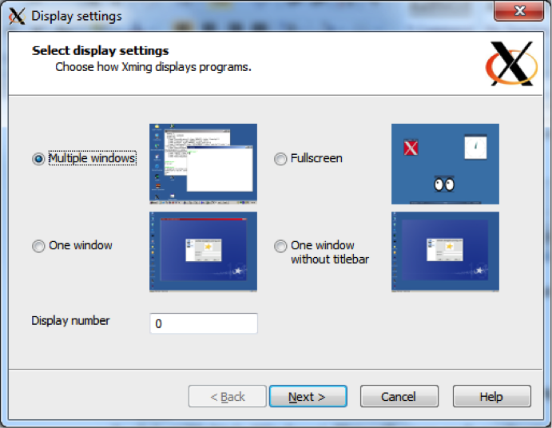
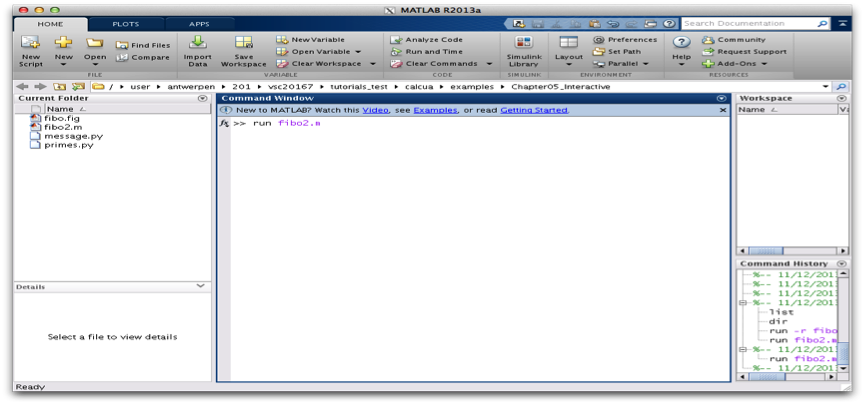



# Running interactive jobs

## Introduction

Interactive jobs are jobs which give you an interactive session on one
of the compute nodes. Importantly, accessing the compute nodes this way
means that the job control system guarantees the resources that you have
asked for.

Interactive PBS jobs are similar to non-interactive PBS jobs in that
they are submitted to PBS via the command **qsub**. Where an interactive job
differs is that it does not require a job script, the required PBS
directives can be specified on the command line.

Interactive jobs can be useful to debug certain job scripts or programs,
but should not be the main use of the {{ hpcinfra }}. Waiting for user input takes a
very long time in the life of a CPU and does not make efficient usage of
the computing resources.

The syntax for *qsub* for submitting an interactive PBS job is:

<pre><code><b>$ qsub -I <... pbs directives ...></b>
</code></pre>

## Interactive jobs, without X support

!!! tip
    Find the code in "~/{{ exampledir }}"

First of all, in order to know on which computer you're working, enter:

<pre><code><b>$ hostname -f</b>
{{ loginhost }}
</code></pre>

This means that you're now working on the login node ` {{ loginhost }} ` of the cluster.

The most basic way to start an interactive job is the following:

<pre><code><b>$ qsub -I</b>
qsub: waiting for job {{ jobid }} to start
qsub: job {{ jobid }} ready
</code></pre>

There are two things of note here.

1.  The "*qsub"* command (with the interactive -I flag) waits until a
    node is assigned to your interactive session, connects to the
    compute node and shows you the terminal prompt on that node.

2.  You'll see that your directory structure of your home directory has
    remained the same. Your home directory is actually located on a
    shared storage system. This means that the exact same directory is
    available on all login nodes and all compute nodes on all clusters.

In order to know on which compute-node you're working, enter again:

<pre><code><b>$ hostname -f</b>
{{ computenode }}
</code></pre>

Note that we are now working on the compute-node called "*{{ computenode }}*". This is the
compute node, which was assigned to us by the scheduler after issuing
the "*qsub -I*" command.


This computer name looks strange, but bears some logic in it. It
provides the system administrators with information where to find the
computer in the computer room.

The computer "*{{ computenodeshort }}*" stands for:

1.  "r5" is rack #5.

2.  "c3" is enclosure/chassis #3.

3.  "cn08" is compute node #08.

With this naming convention, the system administrator can easily find
the physical computers when they need to execute some maintenance
activities.


Now, go to the directory of our second interactive example and run the
program "primes.py". This program will ask you for an upper limit
($> 1$) and will print all the primes between 1 and your upper limit:

<pre><code><b>$ cd ~/{{ exampledir }}</b>
<b>$ ./primes.py</b>
This program calculates all primes between 1 and your upper limit.
Enter your upper limit (>1): <b>50</b>
Start Time:  2013-09-11 15:49:06
[Prime#1] = 1
[Prime#2] = 2
[Prime#3] = 3
[Prime#4] = 5
[Prime#5] = 7
[Prime#6] = 11
[Prime#7] = 13
[Prime#8] = 17
[Prime#9] = 19
[Prime#10] = 23
[Prime#11] = 29
[Prime#12] = 31
[Prime#13] = 37
[Prime#14] = 41
[Prime#15] = 43
[Prime#16] = 47
End Time:  2013-09-11 15:49:06
Duration:  0 seconds.
</code></pre>

You can exit the interactive session with:

<pre><code><b>$ exit</b>
</code></pre>

Note that you can now use this allocated node for 1 hour. After this
hour you will be automatically disconnected. You can change this "usage
time" by explicitly specifying a "walltime", i.e., the time that you
want to work on this node. (Think of walltime as the time elapsed when
watching the clock on the wall.)

You can work for 3 hours by:

<pre><code><b>$ qsub -I -l walltime=03:00:00</b>
</code></pre>

If the walltime of the job is exceeded, the (interactive) job will be
killed and your connection to the compute node will be closed. So do
make sure to provide adequate walltime and that you save your data
before your (wall)time is up (exceeded)! When you do not specify a
walltime, you get a default walltime of 1 hour.

## Interactive jobs, with graphical support

### Software Installation

To display graphical applications from a Linux computer (such as the VSC
clusters) on your machine, you need to install an X Window server on
your local computer.

An X Window server is packaged by default on most
Linux distributions. If you have a graphical user interface this
generally means that you are using an X Window server.

The X Window system (commonly known as **X11**, based on its current major
version being 11, or shortened to simply **X**) is the system-level software
infrastructure for the windowing GUI on Linux, BSD and other UNIX-like
operating systems. It was designed to handle both local displays, as
well as displays sent across a network. More formally, it is a computer
software system and network protocol that provides a basis for graphical
user interfaces (GUIs) and rich input device capability for networked
computers.


Download the latest version of the XQuartz package on:
<http://xquartz.macosforge.org/landing/> and install the XQuartz.pkg
package.

<center>

</center>

The installer will take you through the installation procedure, just
continue clicking ++"Continue"++ on the various screens that will pop-up until your
installation was successful.

A reboot is required before XQuartz will correctly open graphical
applications.

<center>

</center>


##### Install Xming

The first task is to install the Xming software.

1.  Download the Xming installer from the following address:
    <http://www.straightrunning.com/XmingNotes/>. Either download Xming
    from the **Public Domain Releases** (free) or from the **Website Releases** (after a donation) on the website.

2.  Run the Xming setup program on your Windows desktop.

3.  Keep the proposed default folders for the Xming installation.

4.  When selecting the components that need to be installed, make sure
    to select "*XLaunch wizard*" and "*Normal PuTTY Link SSH client*".

    <center>
    
    <center>

5.  We suggest to create a Desktop icon for Xming and XLaunch.

6.  And ++"Install"++.

And now we can run Xming:

1.  Select XLaunch from the Start Menu or by double-clicking the Desktop
    icon.

2.  Select ++"Multiple Windows"++. This will open each application in a separate window.

    <center>
    
    </center>

3.  Select ++"Start no client"++ to make XLaunch wait for other programs (such as PuTTY).

    <center>
    
    </center>

4.  Select ++"Clipboard"++ to share the clipboard.

    <center>
    
    </center>

5.  Finally ++"Save configuration"++ into a file. You can keep the default filename and save it
    in your Xming installation directory.

    <center>
    
    </center>

6.  Now Xming is running in the background ...
    and you can launch a graphical application in your PuTTY terminal.

7.  Open a PuTTY terminal and connect to the HPC.

8.  In order to test the X-server, run "*xclock*". "*xclock*" is the
    standard GUI clock for the X Window System.

<pre><code><b>$ xclock</b>
</code></pre>

You should see the XWindow clock application appearing on your Windows
machine. The "*xclock*" application runs on the login-node of the {{ hpc }}, but
is displayed on your Windows machine.

<center>

</center>

You can close your clock and connect further to a compute node with
again your X-forwarding enabled:

<pre><code><b>$ qsub -I -X</b>
qsub: waiting for job {{ jobid }} to start
qsub: job {{ jobid }} ready
<b>$ hostname -f</b>
{{ computenode }}
<b>$ xclock</b>
</code></pre>

and you should see your clock again.

##### SSH Tunnel

In order to work in client/server mode, it is often required to
establish an SSH tunnel between your Windows desktop machine and the
compute node your job is running on. PuTTY must have been installed on
your computer, and you should be able to connect via SSH to the HPC
cluster's login node.

Because of one or more firewalls between your desktop and the HPC
clusters, it is generally impossible to communicate directly with a
process on the cluster from your desktop except when the network
managers have given you explicit permission (which for security reasons
is not often done). One way to work around this limitation is SSH
tunnelling.

There are several cases where this is useful:

1.  Running graphical applications on the cluster: The graphical program
    cannot directly communicate with the X Window server on your local
    system. In this case, the tunnelling is easy to set up as PuTTY will
    do it for you if you select the right options on the X11 settings
    page as explained on the page about text-mode access using PuTTY.

2.  Running a server application on the cluster that a client on the
    desktop connects to. One example of this scenario is ParaView in
    remote visualisation mode, with the interactive client on the
    desktop and the data processing and image rendering on the cluster.
    This scenario is explained on this page.

3.  Running clients on the cluster and a server on your desktop. In this
    case, the source port is a port on the cluster and the destination
    port is on the desktop.

Procedure: A tunnel from a local client to a specific computer node on
the cluster

1.  Log in on the login node via PuTTY.

2.  Start the server job, note the compute node's name the job is
    running on (e.g., {{ computenode }}), as well as the port the server is listening on
    (e.g., "54321").

3.  Set up the tunnel:

    1.  Close your current PuTTY session.

    2.  In the "*Category*" pane, expand ++"Connection>SSh"++, and select as show below:

        <center>
        
        </center>

    3.  In the ++"Source port"++ field, enter the local port to use (e.g., *5555*).

    4.  In the ++"Destination"++ field, enter *<hostname>:<server-port>* (e.g., {{ computenode }}:54321
        as in the example above, these are the details you noted in the
        second step).

    5.  Click the ++"Add"++ button.

    6.  Click the ++"Open"++ button

The tunnel is now ready to use.



### Connect with X-forwarding

In order to get the graphical output of your application (which is
running on a compute node on the {{ hpc }}) transferred to your personal screen,
you will need to reconnect to the {{ hpc }} with X-forwarding enabled, which is
done with the "-X" option.

<center>

</center>

First exit and reconnect to the {{ hpc }} with X-forwarding enabled:

<pre><code><b>$ exit</b>
<b>$ ssh --X {{ userid }}@{{ loginnode }}</b>
<b>$ hostname -f</b>
{{ loginhost }}
</code></pre>

We first check whether our GUIs on the login node are decently forwarded
to your screen on your local machine. An easy way to test it is by
running a small X-application on the login node. Type:

<pre><code><b>$ xclock</b>
</code></pre>

And you should see a clock appearing on your screen.

<center>

</center>

You can close your clock and connect further to a compute node with
again your X-forwarding enabled:

<pre><code><b>$ qsub -I -X</b>
qsub: waiting for job {{ jobid }} to start
qsub: job {{ jobid }} ready
<b>$ hostname -f</b>
{{ computenode }}
<b>$ xclock</b>
</code></pre>

and you should see your clock again.

### Run simple example

We have developed a little interactive program that shows the
communication in 2 directions. It will send information to your local
screen, but also asks you to click a button.

Now run the message program:

<pre><code><b>$ cd ~/{{ exampledir }}</b>
<b>./message.py</b>
</code></pre>

You should see the following message appearing.

<center>

</center>

Click any button and see what happens.

```
-----------------------
< Enjoy the day! Mooh >
-----------------------
     ^__^
     (oo)\_______
     (__)\       )\/\
         ||----w |
         ||     ||

```

<!-- MATLAB is not available on the hpc in gent, we do not have enought licenses to start MATLAB on 1000 nodes -->


### Run your interactive application

In this last example, we will show you that you can just work on this
compute node, just as if you were working locally on your desktop. We
will run the Fibonacci example of the previous chapter again, but now in
full interactive mode in MATLAB.

::: prompt
:::

And start the MATLAB interactive environment:

::: prompt
:::

And start the fibo2.m program in the command window:

::: prompt
fx \>\>
:::

::: center
{width="5.84in" height="4.11in"}
:::

And see the displayed calculations, ...

::: center
{width="5.84in" height="4.11in"}
:::

as well as the nice "plot" appearing:

::: center
{width="5.76in" height="2.94in"}
:::

You can work in this MATLAB GUI, and finally terminate the application
by entering "" in the command window again.

::: prompt
fx \>\>
:::
