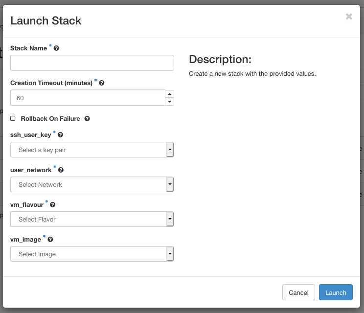

# Orchestration Using Heat

Heat is the name of the OpenStack orchestration engine, which can manage complete
configurations of all servers, volumes, users, networks and routers that
make up a cloud application. Instead of managing every component
separately, we can create, start, stop or clean up our complete
application in a single step. In OpenStack, such a collection of
resources is called a _stack_.

Heat has its own dashboard interface, which you can find under the tab. Official
documentation for Heat and its dashboard interface can be found at the
following locations:

-   [https://docs.openstack.org/heat/latest](https://docs.openstack.org/heat/latest)

-   [https://docs.openstack.org/heat-dashboard/latest](https://docs.openstack.org/heat-dashboard/latest)

## Heat Orchestration Template

A _stack's_
resources and their mutual dependencies can be specified in a text file,
called a
Heat Orchestration Template. The syntax of these
templates conforms to the _yaml_ standard, for which many text editors
provide specialized editing modes. The [Template
Guide](https://docs.openstack.org/heat/\osversion/template_guide) in
the Heat documentation contains a specification of the _HOT_ format, as well as information on how to describe the various types of
resources in a template.

VSC provides some example templates at
[github.com/hpcugent/openstack-templates](https://github.com/hpcugent/openstack-templates),
which can serve as a starting point for your own templates, or as
examples.

The following example describes a stack consisting of a single VM:

```yaml
heat_template_version: 2018-08-31

description: > 
    This template instantiates a basic VM.

parameters:
    user_key:
        type: string
        label: ssh_user_key
        description: Public user ssh key to be injected in the cluster VMs
        constraints:
            - custom_constraint: nova.keypair
    vm_flavour:
        type: string
        label: vm_flavour
        description: Flavour for the VM
        constraints:
            - custom_constraint: nova.flavor
    vm_image:
        type: string
        label: vm_image
        description: Required VM image
        constraints:
            - custom_constraint: glance.image
    user_network:
        type: string
        label: user_network
        description: Add the required VM network
        constraints:
            - custom_constraint: neutron.network

resources:
    my_server:
        type: OS::Nova::Server
        properties:
          name: MyServer
          metadata:
              # Some metadata examples to be included in the VM
              server: master
              color: red
          security_groups: 
              - default
          networks: 
              - network: { get_param: user_network }
                tag: master_ip
          key_name: { get_param: user_key }
          image: { get_param: vm_image }
          flavor: { get_param: vm_flavour }

```

Our example contains four main sections:

**heat_template_version**

The HOT specification has evolved since its initial
release. The key `heat_template_version` indicates the version of
the syntax used in this template. It's value can be a release date
or (in recent version) the name of the version.

**description**

Providing a description is optional, but recommended.

**parameters**

Another optional section, `parameters` allow users to configure
various properties when instantiating a new stack, without having to
edit the template itself. A parameter value can be used elsewhere in
the template using the function `get_param`. In this example, we use
parameters to choose an SSH key, instance size ("flavor"), image,
and a network.

**resources**

This section contains all the resources used by the Stack. In this
case, there is just a single VM instance (OS::Nova::Server).

Optional additional sections are **paremeter_groups**, **outputs**, and .

## The Template Generator

The Heat dashboard provides a graphical interface where users can draw
templates by dragging resources onto a canvas, and connecting them.
Users can then download a template generated from this interface, or
immediately instantiate it as a stack.

Currently, there are a number of issues with the template generator,
which require manual edits to the generated templates. Therefore, the
template generator is currently not very useful. We will update this
section as soon as these problems are solved.

## Managing stacks

The button in the tab takes you to the overview page where you can
launch, suspend, resume and delete stacks.


The overview page contains a list of all currently existing stacks
(either running or suspended), and buttons to perform the following
actions:

### Launch a stack

1.  Click to open the following wizard:


2.  Provide a template and --- optionally --- an environment for the
    stack.

    1. **Template Source**
    
       You can provide a template using one of the following options:

    2. **File**

        Provide a local file on your system.

    3. **Direct Input**

        Enter the template in a text field.

    4. **URL**

        Provide a URL to have OpenStack download the
        template from that location.

        In our example, we provide a URL from the
        repository https://github.com/hpcugent/openstack-templates,
        to instantiate the example from previous [section](#heat-orchestration-template).
        If you want to provide a template directly from GitHub, make sure to provide a "Raw"
        URL, `https://raw.githubusercontent.com/`....

    5. **Environment Source**

        Optionally, you can also provide an environment file. This is
        another [yaml]{.smallcaps} file, which contains customizations
        for your Heat templates, such as default values for parameters,
        or custom resource types you have created (see
        '[Environments](https://docs.openstack.org/heat/\osversion/template_guide/environment.html)'
        in the Heat template guide). You can provide a **File** or choose **Direct Input**.

3.  If you click **Next**, OpenStack will process the template. You can now
    enter a name for the stack, and provide values for all the template
    parameters:





4.  Click **Launch** to instantiate the stack.

### Preview Stack

starts a wizard similar to the "Launch Stack" wizard, but completing the
wizard will only make the system perform a sanity check of your
template, without instantiating the stack. If the check passes, you can
inspect the parameters of the stack that would be created. The wizard
does not allow you to enter input parameter values, so any mandatory
input parameters should be provided in an environment.

### Delete Stacks

deletes all selected stacks from the list .

Deleting a stack also deletes all of the resources (volumes, ports)
created by that stack, unless a different policy was set in the property
for those resources (see the [Resources
section](https://docs.openstack.org/heat/\osversion/template_guide/hot_spec.html#resources-section)
in the HOT specification).

### More Actions

The button **More Actions** hides the following additional actions:

**Check Stacks** verifies if the resources for selected stacks are still running.

**Suspend Stacks** suspends all resources of the selected stacks.

**Resume Stacks** resumes the selected (suspended) stacks.


You can quickly suspend, resume or delete a single stack using the
drop-down menu in the **Actions** column of the overview. This menu also contains
the option **Change Stack Template**, which allows you to update a Stack by providing a new
template.
